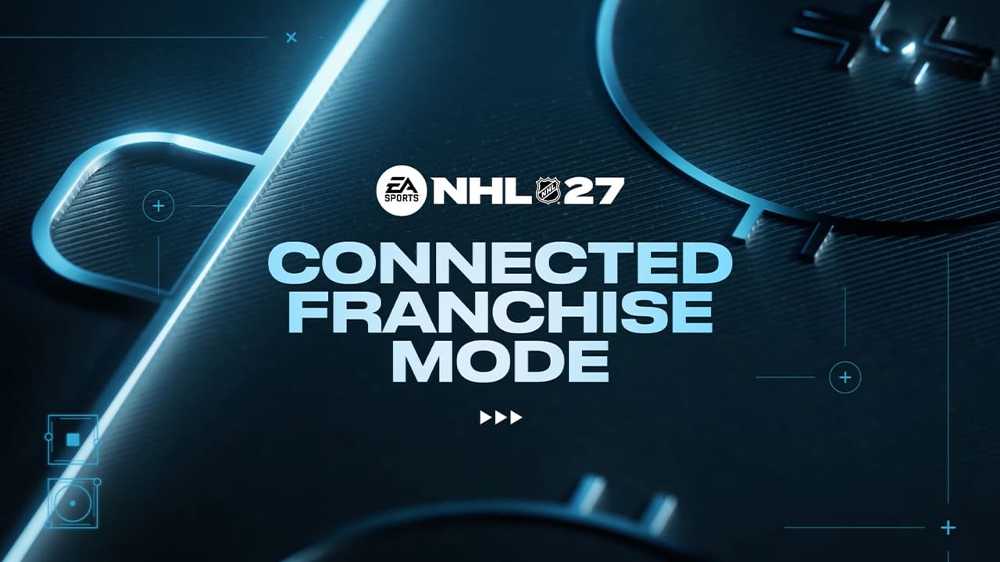

# Регламент турниров в режиме Connected Franchise

## Введение

Основная часть правил наследуется из [основного регламента турниров CYBER-ICE.RU](/nhl/nhl.md).

Далее будут рассмотрены дополнительные правила или модификация пунктов из основного регламента специально для режима Connected Franchise (далее — **Франшиза**).

### Термины и определения

| Термин | Определение |
| :--- | :--- |
| **Комиссар** | Создатель и администратор внутриигровой лиги, обладающий правами утверждения трансферов и управления настройками режима. |
| **Генеральный менеджер (ГМ)** | Участник турнира, непосредственно управляющий выбранным клубом (составом, сделками) и играющий за него матчи в ходе текущего сезона. |
| **Аукцион (Свободные агенты)** | Механика закрытых торгов за подписание игроков без действующего контракта (Free Agents). |

---

## 1 Трансферы

1.1 Трансферы совершаются ГМ по взаимной договорённости, но требуют обязательного одобрения Комиссаром лиги.

1.2 Рассмотрение трансферов Комиссаром проходит три раза в неделю: в **понедельник, среду и субботу в 21:00 по МСК**.

1.2.1 Перенос времени. Дни трансферных окон строго фиксированы. Комиссар оставляет за собой право сместить временной интервал (например, с 21:00 до 21:30) в случае форс-мажора или личных обстоятельств, предварительно уведомив всех ГМ турнира. Если Комиссар изначально проживает в другом часовом поясе, базовое расписание согласуется и объявляется до старта турнира.

1.3 Количественного лимита на число совершённых сделок за сезон нет — обмениваться можно без ограничений, пока открыты трансферные окна.

1.4 Если один и тот же хоккеист задействован одновременно в нескольких отправленных предложениях обмена, Комиссар рассматривает и одобряет только ту сделку, которая была создана раньше по времени. ГМ могут самостоятельно отменить или отозвать неактуальные предложения до момента их проверки Комиссаром.

1.5 Трансферная сделка должна удовлетворять следующим требованиям:

1.5.1 Проводиться строго по ходу регулярного сезона.

1.5.2 Разница в суммарной стоимости контрактов обмениваемых игроков (кепхит) не должна превышать $3,000,000.

1.5.3 В результате совершенного обмена обе команды обязаны оставаться в пределах установленного правилами потолка и пола зарплат.

1.6 Комиссар оставляет за собой право отклонить сделку при выявлении фактов злоупотребления механикой (например: фиктивная аренда топ-игроков, одностороннее усиление состава фаворита и т.п.).

*Трансферы — это возможность построить команду мечты и сбалансировать состав, а не инструмент для искусственной накрутки общего рейтинга (OVR).*

1.7 Помните: трансферы не являются обязательными. Каждый ГМ вправе провести весь сезон стартовым составом команды (по аналогии с режимом Online Versus).

## 2 Рынок свободных агентов (Аукцион)

2.1 Подписание свободных агентов проходит по механике закрытого аукциона: предложение по контракту формируется скрытно. Другие ГМ и Комиссар не видят претендентов на игрока и суммы сделанных ставок вплоть до момента подведения итогов.

2.2 Комиссар одобряет ставки по аукциону три раза в неделю — **в понедельник, среду и субботу в 21:00 по МСК**. Система автоматически распределяет игроков тем ГМ, чьё финансовое предложение оказалось наибольшим.

2.3 Лимит подписаний: в течение одного сезона каждому клубу разрешено подписать не более 5 свободных агентов суммарно.

## 3. Проведение матчей и обрывы соединения

3.1 Из-за технического устройства режима Connected Franchise внутриигровой счёт нельзя внести вручную по сумме нескольких игр, как это делается в Online Versus или HUT. Результат фиксируется игрой строго по окончании одного завершённого матча.

3.2 В случае дисконнекта (обрыва соединения) соперники обязаны:
* Создать повторное лобби.
* Восстановить счёт, зафиксированный на момент обрыва.
* Доиграть оставшееся чистое игровое время матча (например, если обрыв произошёл на отметке 10:00 второго периода при счёте 2:1, команды воспроизводят счёт 2:1 и играют до конца матча оставшиеся 30 минут игрового времени).

3.3 В связи со спецификой фиксации результатов «правило милосердия» в режиме Франшизы приостановлено. Все встречи доигрываются до финальной сирены независимо от текущего счёта.

## 4 Заключительные положения и адаптация правил

4.1 Данный сезон является дебютным для режима Франшизы. Потребуется время и практика, чтобы в полной мере оценить механики и тонкости режима в перспективе.

4.2 В связи с этим Администрация турнира оставляет за собой право в спорных или не описанных в данном регламенте ситуациях принимать оперативные решения по ходу сезона. Такие решения направлены исключительно на конструктивное урегулирование и сохранение баланса.

4.3 Все прецеденты и новые правила, сформированные в ходе сезона, будут зафиксированы и официально включены в данный регламент для последующих турниров.
