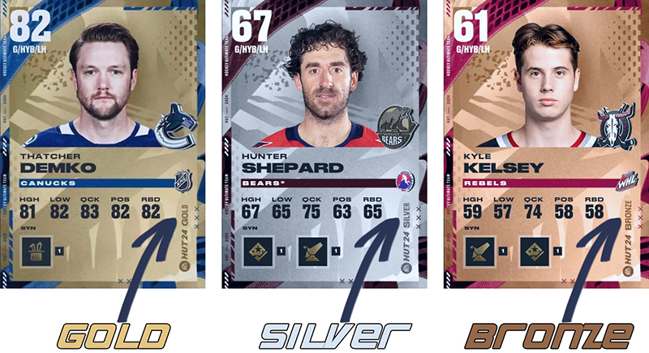

# Регламент турниров по виртуальному хоккею в режиме Hockey Ultimate Team (HUT)

## Введение

Основная часть правил наследуется из [основного регламента турниров XBOXNHL](/nhl/nhl.md).

Также в турнирах в режиме HUT [действуют временные рамки](/timeLimit/timeLimit.md).

Далее будут рассмотрены дополнительные правила или модификация пунктов из основного регламента специально для режима Hockey Ultimate Team.

> Турнир проводится в следующих версиях игры:
> 
> NHL25 - Xbox Series X|S и PlayStation 5
> 
> NHL24 - Xbox One и PlayStation 4

## 1 Требования к команде

1.0 Перед началом турнира игроки должны предоставить названия своих команд в режиме HUT для внесения их в турнирную таблицу. Названия написать в том же регистре, что и в самой игре. Например, если у вас команда в HUT называется "Team", то так и написать в чате. Если "TEAM" или "TeaM", то это тоже должно быть обозначено.

1.1 Общий рейтинг команды не должен превышать значение, установленное в разделе [**2 Варианты турнира**](#2-варианты-турнира). Узнать, какой OVR у соперника, можно сложив три показателя (атака, защита, вратарь) и разделить на три, пока вы подготавливаетесь к матчу или уже находитесь на экране загрузки. Пример на рисунке ниже.

1.2 Название команды не должно содержать оскорбительных слов.

1.3 Состав команды разрешается менять по ходу турнира. Главное, чтобы он не противоречил правилам, установленным в разделе [**2 Варианты турнира**](#2-варианты-турнира).

## 2 Варианты турнира

### 2.1 Gold Cards HUT Tournament

#### 2.1.1 Требования к карточкам игроков

2.1.1.1 Карточки игроков и обоих вратарей должны быть **Базовыми Золотыми**.

2.1.1.2 Серебряные и Бронзовые карточки, карточки из коллекций, X-факторы, Базовые Иконы и прочее не допускаются.

2.1.1.3 Разрешены карточки как игроков из NHL, так из Сборных, AHL, WHL и т.д. Главное, чтобы они были **Базовыми и Золотыми** одновременно.

#### 2.1.2 Требования к рейтингу команды

2.1.2.1 Общий рейтинг команды не должен превышать 84 OVR.

### 2.2 All Cards HUT Tournament

#### 2.2.1 Требования к карточкам игроков

2.2.1.1 Карточки игроков и вратарей в команде могут быть из любой коллекции. Ограничений нет.

2.2.1.1 Рейтинг карточки должен составлять максимум 85 OVR.

#### 2.2.2 Требования к рейтингу команды

2.2.2.1 Общий рейтинг команды не должен превышать 82 OVR.

## 3 Различия базовых карточек (для Gold Cards HUT Tournament)

3.1 Отличие Золотой карточки от Серебряной в том, что у Золотой в правом нижнем углу написано GOLD, а у Серебряной - SILVER. Есть ещё Бронзовые; у них надпись BRONZE. Пример ниже:

## 4 Плей-офф

4.1 Серия плей-офф играется в формате Best of 5 (до 3-х побед).

## 5 Нарушения

5.1 За нарушение пунктов 1 и 2 и их подпунктов ставится техническое поражение в матче. Игроки должны предоставить доказательства, что у соперника в команде неподходящие карточки, в формате фото или видео.
