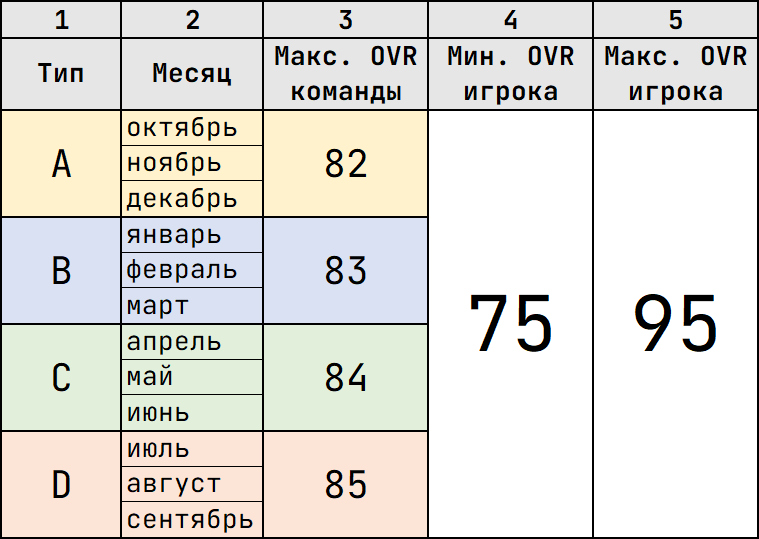
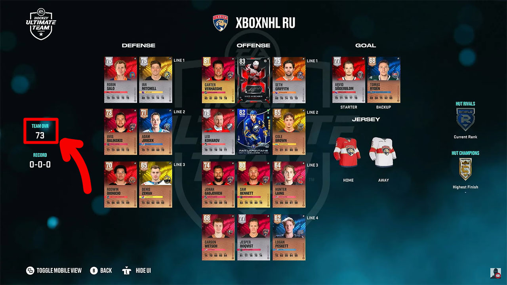

# Регламент турниров по виртуальному хоккею в режиме Hockey Ultimate Team (HUT)

## Как играть в HUT

> По просьбам участников был записан ролик, объясняющий, как начать свои первые шаги в данном режиме:
>
>  https://youtu.be/YlyVUGsQ-rk
>
>  https://vk.com/video-215401666_456239053

## Введение

Основная часть правил наследуется из [основного регламента турниров CYBER-ICE.RU](/nhl/nhl.md).

Также в турнирах в режиме HUT [действуют временные рамки](/timeLimit/timeLimit.md).

Далее будут рассмотрены дополнительные правила или модификация пунктов из основного регламента специально для режима Hockey Ultimate Team.

## 1 Требования к команде

### 1.1 Название команды

1.1.1 При подаче заявки на участие в турнире игроки обязаны указывать названия своих команд в режиме HUT строго в том виде, как они представлены в самой игре.

1.1.2 Запрещается использовать названия команд, содержащие оскорбительные, нецензурные, дискриминационные выражения, а также иные формулировки, противоречащие нормам общественной морали и законодательства. Администрация турнира оставляет за собой право отклонить регистрацию команды, если её название признано несоответствующим указанным требованиям.

### 1.2 Рейтинг команды и состав

#### 1.2.1 Требования к картам игроков и вратарей

1.2.1.1 Игроки и вратари в команде могут быть из любой коллекции.

1.2.1.2 Рейтинг карт игроков и обоих вратарей должен быть минимум 75 OVR, а максимум 95 OVR.

#### 1.2.2 Требования к команде

1.2.1.1 В зависимости от месяца начала турнира определяется максимальный OVR команды. Этот OVR фиксируется перед стартом сезона и действует, пока не завершится сезон.

1.2.1.2 Если турнир проводится не в актуальной версии игры, то применяются ограничения типа D.

1.2.1.3 Состав команды разрешается менять по ходу турнира. Главное, чтобы он не противоречил пунктам выше текущего.

### 1.3 Перед матчем

1.3.1 Перед началом игры соперники должны предоставить друг другу скриншоты из HUT HUB, где виден состав и рейтинг их команды, чтобы убедиться, что он соответствует пунктам 1.1, 1.2 и всем их подпунктам.

<figure>
    
    <figcaption style="text-align: center;"><i>Пример скриншота из HUT HUB</i></figcaption>
</figure>

## 2 Плей-офф

2.1 Серия плей-офф играется в формате Best of 5 (до 3-х побед).

## 3 Нарушения

3.1 За нарушение правил требований к команде ставится техническое поражение в матче или требуется переигровка, если оба участника согласны. Игроки должны предоставить доказательства, что у соперника в команде неподходящие карточки, в формате фото или видео.

## 4 Случаи фальсификации

4.1 Фальсификация скриншота состава и рейтинга команды (из раздела [**1 Требования к команде**](#1-требования-к-команде)) влечет за собой наложение штрафа в виде ТП в том матче, где это было обнаружено, согласно разделу [**3 Нарушения**](#3-нарушения).

4.2 Совет: держите фото своей команды в актуальном состоянии. И не забывайте делать его заново, если у вас произошли ротации в составе. 👍