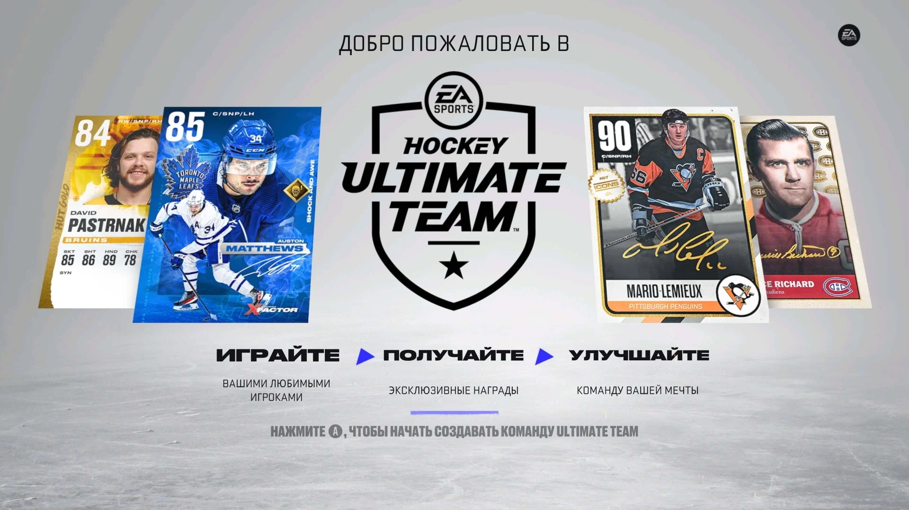

# Регламент турниров по виртуальному хоккею в режиме Hockey Ultimate Team (HUT)

## Как играть в HUT

> По просьбам участников был записан ролик, объясняющий, как начать свои первые шаги в данном режиме:
>
>  https://youtu.be/YlyVUGsQ-rk
>
>  https://vk.com/xboxnhl?z=video-215401666_456239053

## Введение

Основная часть правил наследуется из [основного регламента турниров XBOXNHL](/nhl/nhl.md).

Также в турнирах в режиме HUT [действуют временные рамки](/timeLimit/timeLimit.md).

Далее будут рассмотрены дополнительные правила или модификация пунктов из основного регламента специально для режима Hockey Ultimate Team.

> Турнир проводится в следующих версиях игры:
> 
> NHL25 - Xbox Series X|S и PlayStation 5
> 
> NHL24 - Xbox One и PlayStation 4

## 1 Требования к команде

### 1.1 Название команды

1.1.1 Перед началом турнира игроки должны предоставить названия своих команд в режиме HUT для внесения их в турнирную таблицу. Названия написать в том же регистре, что и в самой игре. Например, если у вас команда в HUT называется "Team", то так и написать в чате. Если "TEAM" или "TeaM", то это тоже должно быть обозначено.

1.1.2 Запрещается использовать названия команд, содержащие оскорбительные, нецензурные, дискриминационные выражения, а также иные формулировки, противоречащие нормам общественной морали и законодательства. Администрация турнира оставляет за собой право отклонить регистрацию команды, если её название признано несоответствующим указанным требованиям.

### 1.2 Рейтинг команды

1.2.1 Общий рейтинг команды должен составлять максимум **82 OVR**. 

1.2.2 Узнать, какой OVR у соперника, можно, сложив три показателя (**OFF**, **DEF**, **GOA**) и разделив на три, пока вы подготавливаетесь к матчу или уже находитесь на экране загрузки. Пример на рисунке под спойлером:

Рейтинг на экране загрузки <i>(клик)</i>

### 1.3 Состав команды

1.3.1 Карточки игроков и вратарей в команде могут быть из любой коллекции.

1.3.2 Рейтинг карточки должен составлять максимум **86\* OVR**.

1.3.3 \*В будущих сезонах рейтинг карточек может быть увеличен в зависимости от выхода новых карт в самой игре.

1.3.4 Состав команды разрешается менять по ходу турнира. Главное, чтобы он не противоречил правилам, установленным в разделе [**1 Требования к команде**](#1-требования-к-команде).

## 2 Плей-офф

2.1 Серия плей-офф играется в формате Best of 5 (до 3-х побед).

## 3 Нарушения

3.1 За нарушение правил требований к команде ставится техническое поражение в матче или требуется переигровка, если оппонент согласен. Игроки должны предоставить доказательства, что у соперника в команде неподходящие карточки, в формате фото или видео.