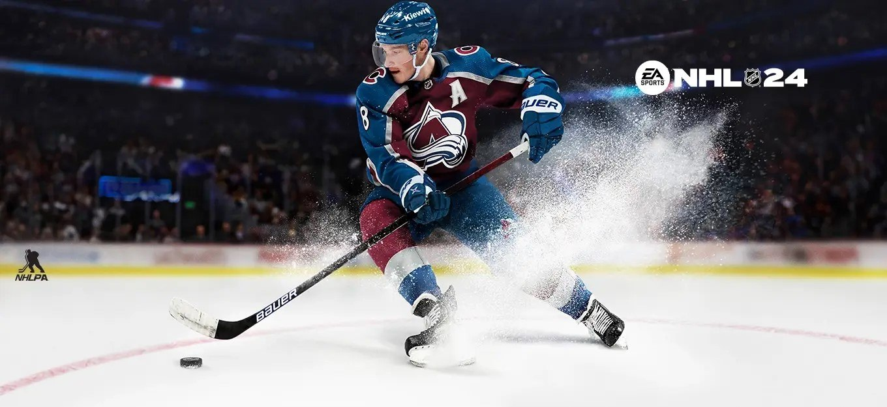
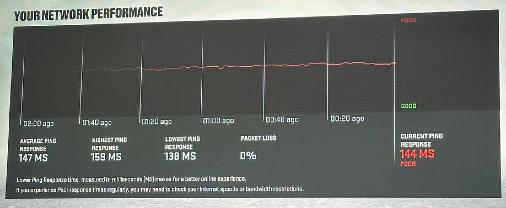
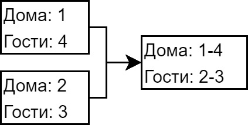
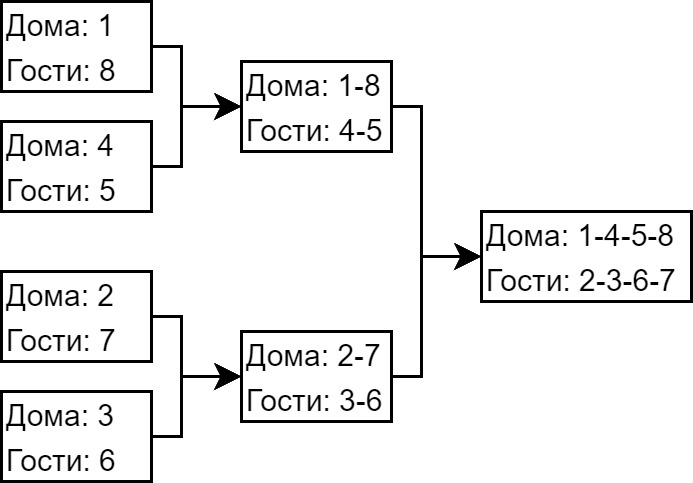
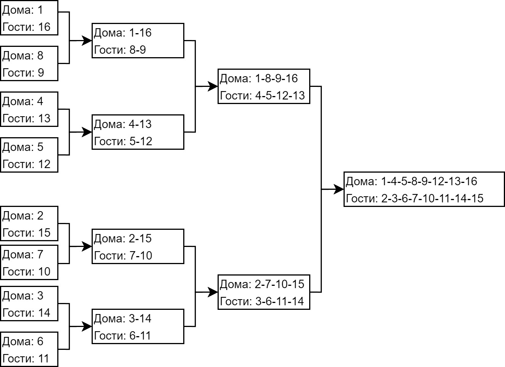

# Регламент турниров по виртуальному хоккею в режиме Online Versus

## 1 Общие положения

Общие положения распространяются на все матчи в независимости от этапа – групповой, плей-офф или финал. Все вопросы, не описанные в данной версии регламента, решаются через Администрацию турнира.

### 1.1 Итоги матча

1.1.1 После матча один (или оба) из участников должен скинуть фотографию результатов каждого матча в чат турнира, а второй участник должен подтвердить, что это результат именно этого матча, либо опровергнуть, прикрепив необходимые доказательства.

### 1.2 Настройки матча

1.2.1 Матч играется со следующими настройками:

-   **тип игры** – Competitive;
-   **длительность периода** – 4 минуты;
-   **правила** – NHL;
-   **сложность** – Superstar;
-   **игрок управляет вратарём при буллитах** - вкл.

1.2.2 Во время стадии плей-офф данные настройки остаются такими же, кроме ОТ – должен быть выбран **Continuous OT 5 на 5**.

### 1.3 Досрочное завершение игры

1.3.1 При досрочном завершении игры покинувшему игроку засчитывается поражение со счётом **«0:5»**. Если счёт был больше, то учитывается именно он, а результат вышедшего участника обнуляется (в данном ситуации просьба предоставить скриншот, на котором количество заброшенных шайб больше пяти).

### 1.4 Обрыв соединения

1.4.1 При обрыве соединения просьба предоставить доказательства, то есть фотографии или видео трансляции, для дальнейшего разбирательства. На фотографиях или на видео должно быть отображение потери соединения и счёт, при котором остановился матч. Время матча, когда игра прервалась, игроки должны также передать Администрации.

1.4.2 Однако, игроки вправе сами между собой договориться о продолжении матча с учётом оставшегося времени и с сохранением счёта.

1.4.3 В случае, если между игроками при потере соединения возникают разногласия, вопрос о продолжении матча решается через Администрацию турнира с предоставлением всех доказательств, описанных в пункте 1.4.1.

### 1.5 Прямые трансляции

1.5.1 Матчи турнира могут сопровождаются прямой трансляцией на любой стриминговой площадке на выбор. Трансляции группового этапа не обязательны; для плей-офф желательны; а для финала рекомендуемы.

### 1.6 Жеребьёвка

1.6.1 Жеребьёвка о порядке выбора команд в начале каждого турнира проводится с помощью «Колеса Фортуны» в прямом эфире. Администрация обязана предупредить участников о проведении стрима заранее, чтобы участники по желанию могли посетить стрим, дабы убедиться, что жеребьевка идёт в реальном времени и никак не сфальсифицирована.

1.6.2 После того, как определён порядок выбора команд, первому игроку, который должен выбирать команду, даётся 5 минут, чтобы озвучить своё решение в чате. Если же он не успевает по любой причине, то очередь переходит к следующему, а этот игрок отправляется в конец очереди.

1.6.3.1 Однако игроки вправе предупредить Администрацию через личные сообщения заранее о том, какую команду они хотят взять, чтобы в случае недоступности на момент, когда нужно озвучить свой выбор в чате, команда всё же была зафиксирована за игроком. Писать можно все 32 команды при необходимости.

1.6.3.2 Если же игрок написал команды Администрации заранее, но всё, что он написал, было выбрано до него, то в таком случае у участника есть 5 минут, чтобы сообщить новое решение в чате. В противном случае он отправится в конец очереди. Таким образом лучше бронировать не 1-2 команды, а сразу несколько.

1.6.4 После жеребьёвки необходимо подтвердить своё участие в турнире в течение 24-х часов. Для этого необходимо назвать команду, за которую будете играть в сезоне. Поэтому пользуйтесь пунктом 1.6.3, если понимаете, что у вас не будет возможности озвучить свой выбор в течение 24-х часов. Либо предупредите Администрацию заранее иным образом.

> Сделано это специально для того, чтобы избавиться от "мёртвых душ" — людей, кто записывается на турниры и перестаёт появляться в сообществе.

### 1.7 Продолжительность турниров

1.7.1 Турниры ограничены по времени согласно [регламенту о временных рамках](/timeLimit/timeLimit.md); прочесть его обязательно! Участники должны выходить на связь, чтобы предупреждать о том, когда они смогут провести матч, дабы держать в курсе всех игроков и в том числе Администрацию.

### 1.8 Дивизионы

1.8.1 В регламенте от 04.12.2022 было принято решение разделить участников по дивизионам:

-   Серебряный - для новичков и любителей

-   Золотой - для продвинутых любителей и профессионалов

-   Открытый - игроки всех дивизионов играют вместе

### 1.9 Снятие с турнира

Если игрок принимает решение сняться с турнира, то возможны два исхода (1.9.1 и 1.9.2):

1.9.1 Количество сыгранных матчей игрока на групповом этапе меньше половины: игрок удаляется из таблицы, матчи с ним аннулируются.

1.9.2 Количество сыгранных матчей игрока на групповом этапе половина и более: результаты игрока сохраняются, а на несыгранные игры проставляются технические поражения.

1.9.3 Тот, кто попадает в ПО в пару с игроком, который снялся с турнира, автоматически проходит в следующий раунд.

1.9.4 На игрока, который снялся с турнира после начала жеребьёвки без уважительной на то причины, накладывается штраф в виде запрета на участие в следующем сезоне или сезонах.

1.9.5 Если игрок завершил групповой этап, но снялся на этапе плей-офф, то штраф на него наложен не будет.

### 1.11 Пинг

1.11.1 Настоятельно рекомендуется играть с помощью проводного интернет-соединения вместо Wi-Fi для обеспечения стабильного пинга.

1.11.2 В матчах пинг не должен превышать 110 ms. Если на экране загрузки матча у вас показаны красные столбики интернет-соединения (по центру снизу), то можно попробовать выйти из матча до стартового вбрасывания и попробовать снова начать матч с соперником. Есть вероятность, что в таком случае игра будет запущена на ином сервере с оптимальным месторасположением.

1.11.3.1 Новым участникам необходимо провести товарищеские матчи минимум с тремя игроками из разных регионов России из сообщества с целью оценки качества интернет-соединения. Или же с большинством игроком из дивизиона (Золото, Серебро), в котором новые игроки будут играть.

1.11.3.2 Если значение пинга превышает 110 ms, а также наблюдаются регулярные скачки пинга, из-за чего игра превращается в слайд-шоу, то человек к турнирам не должен допускаться, пока данные проблемы не будут исправлены с его стороны.

1.11.3.3 Исключение из правил, когда проблемы с пингом носят индивидуальный характер между отдельными игроками. Например, в турнире участвует 6 человек. У игрока А с четырьмя другими участниками пинг хороший, а с игроком Б пинг плохой, и обратная ситуация - у игрока Б пинг с четырьмя другими участниками пинг нормальный, а с игроком А неудовлетворительный. То в таком случае игроку А и игроку Б в любом случае необходимо провести матч; если же оба игрока не согласны на игру, то в таком случае каждому будет проставлено **0:0 ТП** в их двух матчах.

1.11.4 На все вышеперечисленные пункты распространяется правило, что необходимо предоставлять скриншот из игры с графиком интернет-соединения, по которому видно, что есть проблемы.

Скриншот качества соединения <i>(клик)</i>

 

### 1.12 Реклама, спонсорство, свои турниры на платформе XBOXNHL

1.12.1 Публикация рекламных сообщений без разрешения Администрации не разрешена. Такие сообщения будут удаляться. Если участник сообщества продолжит спамить рекламу, то на него будет либо наложено временное ограничение на отправку сообщений, либо дан бан в чате.

1.12.2.1 Участники вправе проспонсировать плановый турнир, объявив призовой фонд, и назначить правила распределения призового фонда (с планового турнира комиссия на призовой фонд не взимается). Такие люди дальше по тексту называются Спонсорами.

1.12.2.2 Плановым турниром считается такой турнир, который идёт по расписанию, заданному Администрацией.

1.12.2.3 Спонсор может вручить приз сам по окончанию турнира. Но в таком случае Администрация не несёт ответственности за честность Спонсора.

1.12.2.4 Либо Спонсор может до начала турнира перевести призовой фонд Администрации в качестве гаранта. В свою очередь последние внесут Спонсора в официальный список спонсоров текущего турнира.

1.12.3.1 Спонсоры могут предложить через Администрацию свой формат турнира с призовым фондом. В данном случае Спонсор сам выбирает формат турнира (например, командами NHL, сборные, Threes, HUT, World of CHEL и так далее), количество игр, распределение очков, количество мест в плей-офф и назначение призов. Но в таком случае платится комиссия от общего призового фонда на поддержку и развитие платформы - 10%.

1.12.3.2 Призовой фонд такого турнира в обязательном порядке переводится Администрации до начала турнира, включая комиссию.

### 1.13 Система страйков

1.13.1 В ходе игровой недели игроки должны отыгрывать минимальный порог игр.

> Например, если в сезоне 3 игровые недели, за которые нужно провести 18 матчей, то каждую неделю участник должен завершать минимум 6 игр.

1.13.2 Если в конце игровой недели у игрока менее минимума игр за эту неделю, то за это он получает страйк.

1.13.3 В случае получения 2-ух страйков в ходе одного сезона, игрок будет дисквалифицирован с турнира за задержку. И соответственно на него будет наложен временный запрет на участие в следующем сезоне. Ограничение: 1 сезон.

1.13.4 Если у игрока в конце недели менее минимума игр, но не по его вине, то он может предоставить Администрации скриншоты личной переписки, где видно, что он звал оппонента и проявлял активность. В таком случае игрок не получит страйк.

## 2 Групповой этап

2.1.1 Количество матчей в каждом турнире будет динамическим в зависимости от количества участников в текущем и параллельно идущих сезонах.

2.1.2 Когда в сезоне предстоит провести против оппонента чётное количество игр (2, 4 и т.д.), то участники играют половину матчей дома, половину в гостях.

2.1.3 Кто играет первый матч дома игроки договариваются между собой. Если никто не хочет уступать, то следует обратиться к Администрации турнира для разрешения спора.

2.2 После окончания матча проводится подсчёт очков: 2 очка за победу в основное время или за победу в овертайме; 1 очко за поражение в овертайме (в серии буллит); 0 очков за поражение в основное время.

## 3 Плей-офф и финал

3.1 После окончания группового этапа количество игроков, которые выйдут в плей-офф, осуществляется по следующей таблице:

| Количество игроков | Выйдут в плей-офф |
| ------------------ | ----------------- |
| 4                  | 2                 |
| 5                  | 4                 |
| 6                  | 4                 |
| 7                  | 4                 |
| 8                  | 4                 |
| 9                  | 4                 |
| 10                 | 8                 |
| 11                 | 8                 |
| 12                 | 8                 |
| 13                 | 8                 |
| 14                 | 8                 |
| 15                 | 8                 |
| 16                 | 8                 |
| 17                 | 8                 |
| 18                 | 8                 |
| 19                 | 8                 |
| 20 и более         | 16                |

3.2 Распределении мест в группе происходит в следующем порядке:

1. по количеству очков;
2. по количеству побед в основное время;
3. по количеству побед в ОТ;
4. разница шайб забитых и пропущенных (РШ);
5. наибольшее количество заброшенных шайб (ЗШ);
6. при равенстве всех вышеперечисленных показателей распределение мест между командами определяется серией из пяти буллит (скриншот или видео стрима так же требуется в подтверждение).

3.3.1 Участник, набравший максимальное количество очков в группе, играет против участника, который набрал меньшее число очков в группе, но который прошел в серию плей-офф.

3.3.2 Примеры схем плей-офф в зависимости от участников находятся под спойлерами ниже.

Плей-офф 1/2 <i>(клик)</i>

 

Плей-офф 1/4 <i>(клик)</i>

 

Плей-офф 1/8 <i>(клик)</i>

 

3.4 Игра длится до четырёх побед (система Best Of 7).

3.5 Домашний матч начинает первым тот участник, который находится в сетке ПО выше. Сначала проводится два матча дома, затем два матча в гостях, далее идёт чередование через каждую игру дома-гости-дома.