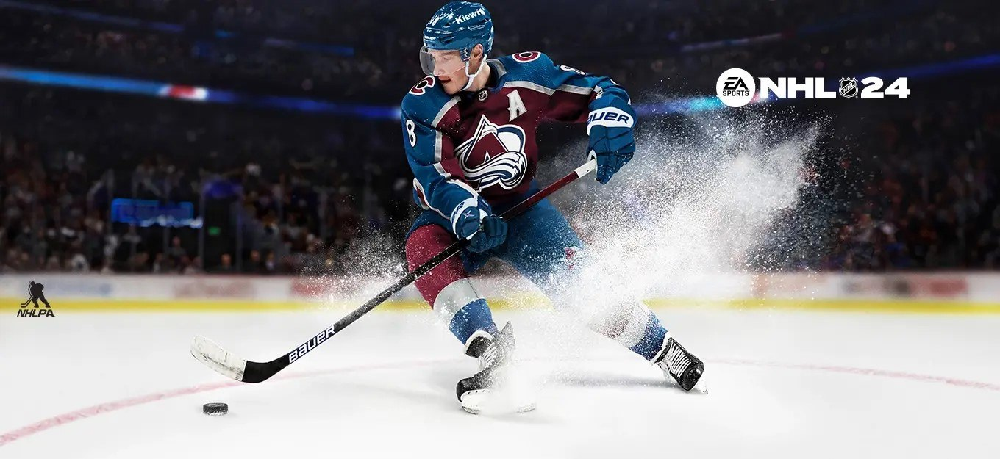
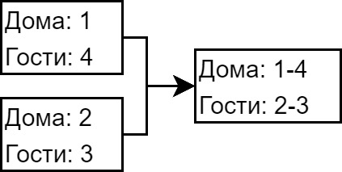
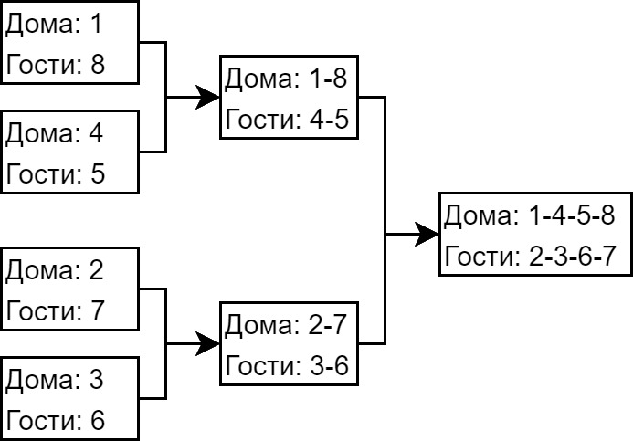
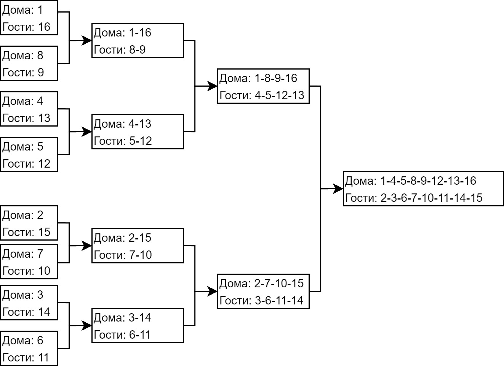

# Регламент турниров по виртуальному хоккею в режиме Online Versus

## 1 Общие положения

Общие положения распространяются на все матчи в независимости от этапа – групповой, плей-офф или финал. Все вопросы, не описанные в данной версии регламента, решаются через Администрацию турнира.

### 1.1 Итоги матча

1.1.1 После матча один из участников должен отправить фотографию с итогами игры в чат турнира. Второй участник должен подтвердить результат или опровергнуть его, приложив необходимые доказательства.

1.1.2 Результаты игр также нужно внести в турнирную таблицу через мини-приложение. Это следует сделать до или после прикрепления фото, чтобы фото и уведомление от бота о добавленном результате были рядом, что упростит валидацию результата.

1.1.2.1 Ссылка на мини-приложение: https://app.cyber-ice.ru

1.1.2.2 При ошибочном внесении необходимо сообщить об этом в чате и уведомить Администратора через `@` для исправления недочёта.

### 1.2 Настройки матча

1.2.1 Матч играется со следующими настройками:

-   **тип игры** – Competitive;
-   **длительность периода** – 4 минуты;
-   **правила** – NHL;
-   **сложность** – Superstar;
-   **игрок управляет вратарём при буллитах** - вкл.

1.2.2 Во время стадии плей-офф данные настройки остаются такими же, кроме ОТ – должен быть выбран **Continuous OT 5 на 5**.

### 1.3 Досрочное завершение игры

1.3.1 При досрочном завершении игры покинувшему игроку засчитывается поражение со счётом **«0:5»**. Если счёт был больше, то учитывается именно он, а результат вышедшего участника обнуляется (в данном ситуации просьба предоставить скриншот, на котором количество заброшенных шайб больше пяти).

### 1.4 Обрыв соединения

1.4.1 При обрыве соединения просьба предоставить доказательства, то есть фотографии или видео трансляции, для дальнейшего разбирательства. На фотографиях или на видео должно быть отображение потери соединения и счёт, при котором остановился матч. Время матча, когда игра прервалась, игроки должны также передать Администрации.

1.4.2 Однако, игроки вправе сами между собой договориться о продолжении матча с учётом оставшегося времени и с сохранением счёта.

1.4.3 В случае, если между игроками при потере соединения возникают разногласия, вопрос о продолжении матча решается через Администрацию турнира с предоставлением всех доказательств, описанных в пункте 1.4.1.

### 1.5 Прямые трансляции

1.5.1 Прямые трансляции игр в регулярном чемпионате рекомендуются, но не являются обязательными.

1.5.2 Все игры плей-офф **обязательно** должны транслироваться на любой видео-платформе. Ссылка на трансляцию должна быть передана в общий чат турнира до начала матчей.

1.5.3 Если обе команды не желают включать стрим, то обязанность по запуску прямой трансляции возлагается на команду, играющую дома.

1.5.4 Если прямая трансляция во время плей-офф отсутствовала, то матчи должны быть переиграны. Либо участники серии должны предоставить веское обоснование отсутствия стрима до начала игр.

### 1.6 Жеребьёвка

1.6.1 Жеребьёвка проводится с использованием специального алгоритма, в котором ключевым параметром является рейтинг игрока. Чем выше рейтинг, тем ниже вероятность получить ранний выбор. Соответственно, игроки с более низким рейтингом имеют более высокий шанс выбирать команды раньше, однако это не гарантирует им приоритетный выбор. Исходный код алгоритма доступен в репозитории [GitHub - Rust Draft System](https://github.com/parmetra/rust_draft_system).

1.6.2. Участникам, ранее не принимавшим участия в соло-турнирах, для целей работы алгоритма присваивается базовый рейтинг 500.

1.6.3 При регистрации участник может указать список желаемых команд (без ограничений на количество). Во время драфта ему достанется первая свободная команда из этого списка.

1.6.4 Порядок выбора команд определяется алгоритмом. Каждому участнику даётся 5 минут на объявление выбора в чате. Если список команд не указан, все желаемые команды уже заняты или участник не уложился во время, ему назначается случайная команда через Telegram-бота.

P.S. Пострегистрация (возможность записаться на турнир после закрытия регистрации) отменяется. Теперь участвовать могут только те, кто вовремя подал заявки, поскольку после драфта будет составлен календарь на сезон, и добавление в него новых команд-участниц после генерации не предусмотрено.

### 1.7 Количество матчей

1.7.1 В среднем за игровую неделю игрокам предстоит отыгрывать 10 игр, чтобы успешно уложиться в график сезона.

### 1.8 Дивизионы

1.8.1 В регламенте от 04.12.2022 было принято решение разделить участников по дивизионам:

-   Серебряный - для новичков и любителей

-   Золотой - для продвинутых любителей и профессионалов

-   Открытый - игроки всех дивизионов играют вместе

### 1.9 Временные рамки, контроль активности и штрафные санкции

Данный раздел вынесен в отдельный документ ввиду его обширного описания. Смотрите по [ссылке](/activity_and_penalties//activity_and_penalties.md).

### 1.10 Пинг

1.10.1 Настоятельно рекомендуется играть с помощью проводного интернет-соединения вместо Wi-Fi для обеспечения стабильного пинга.

1.10.2 Если у одного из игроков возникают проблемы с интернет-соединением, такие как фризы или скачки пинга, мешающие игре, собирается комиссия для рассмотрения ситуации. При подтверждении проблемы могут быть приняты меры, вплоть до исключения участника из турнира или его добровольного снятия.

### 1.11 Тайм-ауты

1.11.1 Если игрок использовала тайм-аут до обрыва соединения, повторное использование тайм-аута в рамках доигровки запрещено.

1.11.2 Нарушение данного правила по запросу команды-соперника может повлечь присуждение технического поражения.

## 2 Групповой этап

2.1.1 Количество матчей в каждом турнире будет динамическим в зависимости от количества участников в текущем и параллельно идущих сезонах.

2.1.2 Когда в сезоне предстоит провести против оппонента чётное количество игр (2, 4 и т.д.), то участники играют половину матчей дома, половину в гостях.

2.1.3 Кто играет первый матч дома игроки договариваются между собой. Если никто не хочет уступать, то следует обратиться к Администрации турнира для разрешения спора.

2.2 После окончания матча проводится подсчёт очков: 2 очка за победу в основное время или за победу в овертайме; 1 очко за поражение в овертайме (в серии буллит); 0 очков за поражение в основное время.

## 3 Плей-офф и финал

3.1 После окончания группового этапа количество игроков, которые выйдут в плей-офф, осуществляется по следующей таблице:

| Количество игроков | Выйдут в плей-офф |
| ------------------ | ----------------- |
| 4                  | 2                 |
| 5                  | 4                 |
| 6                  | 4                 |
| 7                  | 4                 |
| 8                  | 4                 |
| 9                  | 4                 |
| 10                 | 8                 |
| 11                 | 8                 |
| 12                 | 8                 |
| 13                 | 8                 |
| 14                 | 8                 |
| 15                 | 8                 |
| 16                 | 8                 |
| 17                 | 8                 |
| 18                 | 8                 |
| 19                 | 8                 |
| 20 и более         | 16                |

3.2 Распределении мест в группе происходит в следующем порядке:

1. по количеству очков или по проценту набранных очков (определяется перед началом сезона);
2. по количеству побед в основное время;
3. по количеству побед в ОТ;
4. разница шайб забитых и пропущенных (РШ);
5. наибольшее количество заброшенных шайб (ЗШ);
6. при равенстве всех вышеперечисленных показателей распределение мест между командами определяется: а) позицией на драфте, б) в порядке очереди на регистрацию.

3.3 Распределение в плей-офф происходит по одной из двух систем - старой (жесткая сетка) и новой (система посева). Система плей-офф определяется на старте сезона.

3.3.1 Жесткая сетка

Схемы плей-офф в зависимости от количества прошедших участников находятся под спойлерами ниже.

Плей-офф 1/2 <i>(клик)</i>

 

Плей-офф 1/4 <i>(клик)</i>

 

Плей-офф 1/8 <i>(клик)</i>

 

3.3.2 Система посева

**Система посева** — это способ распределить команды в сетке плей-офф так, чтобы команды с наивысшими результатами регулярного чемпионата как можно дольше не встречались друг с другом.

После каждого раунда состав пар пересчитывается: команда с самым высоким посевом играет с командой с самым низким посевом, которая всё ещё участвует в турнире.

3.3.2.1 Формирование пар первого раунда

Командам присваиваются порядковые номера — посевы. В сетке 1-го раунда пара формируется по принципу:
- 1-й посев **vs** N-й посев
- 2-й посев **vs** (N-1)-й посев и т. д.

где N — общее число участников плей-офф.

*Пример:* если в плей-офф выходят первые 8 команд, то команда №1 играет с командой №8, №2 — с №7 и так далее.

3.3.2.2 Пересев после каждого раунда

Каждый следующий раунд пары пересчитываются снова:

- Самый высокий посев встречается с самым низким оставшимся посевом
- Второй по рейтингу — с предпоследним и т. д.

3.4 Игра длится до четырёх побед (система Best Of 7).

3.5 Домашний матч начинает первым тот участник, который находится в сетке ПО выше. Сначала проводится два матча дома, затем два матча в гостях, далее идёт чередование через каждую игру дома-гости-дома.
