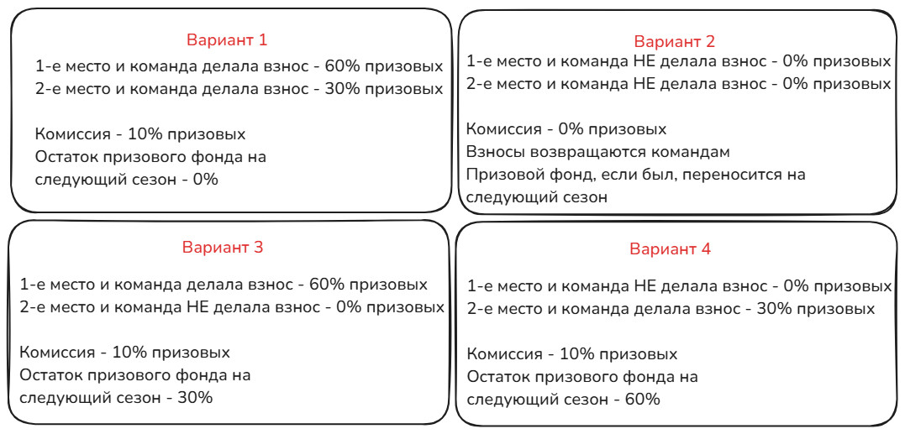

# Призовой фонд

## 1 Общие положения
1.1 Участие в турнирах было, есть и будет _<ins>бесплатным</ins>_, но также есть возможность сделать взнос\* и побороться за призовой фонд.

\*Взнос — это добровольное пожертвование в призовой фонд турнира, которое позволяет команде претендовать на выигрыш из итогового призового фонда.

1.2 Призовой фонд формируется из взносов команд. Минимальное количество команд, сделавших взнос, для розыгрыша призового фонда = 3.

1.3 Взнос с команды — 100 российских рублей.

## 2 Формирование призового фонда

2.1 Создание призового фонда заключается в добровольном внесении суммы взноса (пункт 1.3) до начала сезона, но не позднее 24-х часов после успешной регистрации.

2.2. Цель призового фонда: мотивация команд, сделавших взнос, побороться за призовые турнира.

2.3 Сумма призового фонда собирается из:

- взносов команд;
- предыдущего призового фонда прошлого сезона (если таковой есть);
- компенсаций за нарушения;
- спонсорских пожертвований.

## 3 Порядок формирования призового фонда

3.1 Взносы принимаются исключительно до старта сезона.

3.2 Взнос должен быть согласован с Администрацией.

3.3 Сумма взноса должна быть ровно такой, как указано в пункте 1.3.

3.4 Реквизиты для внесения взносов:

- Т-Банк (ранее Тинькофф): `4377 7278 1436 0819`
- Получатель: Артём К.
- В комментарии к платежу указать только название команды и ваш никнейм в игре

3.5 Если у вас нет возможности сделать перевод на указанный в пункте 3.4 банк, то просим связаться с Администрацией для получения альтернативных методов внесения взноса.

- Ссылка на контакт с Админом: https://t.me/iPhck

3.6 После внесения средств необходимо сообщить об этом Администрации в личные сообщения и прикрепить скриншот, где подтверждается перевод средств.

3.7 О возврате средств см. пункт [6 Случаи возвратов и не возвратов взносов](#6-случаи-возвратов-и-не-возвратов-взносов)

## 4 Распределение призового фонда

4.1 Призовой фонд распределяется только среди команд, кто сделал взнос перед стартом сезона и занял 1-е и 2-е место на турнире в финале.

4.2 Команда-победитель сезона (то есть та команда, которая одержала победу в финальной серии) получает 60% от общего призового фонда.

4.3 Команда, которая дошла до финала, но проиграла команде-победителю в финальной серии, получает 30% от общего призового фонда.

4.4 10% от общего призового фонда переходят Администрации. 10%, удержанных Администрацией (дальше по тексту - комиссия), направлены на развитие и поддержку инструментов для проведения турниров.

4.5.1 Если команда, ставшая победителем сезона, взнос не делала, то в таком случае она не получит призовые, а к призовому фонду следующего сезона будет добавлены 60% от текущих призовых.

4.5.2 Если команда, занявшая 2-е место, взнос не делала, то в таком случае она не получит призовые, а к призовому фонду следующего сезона будет добавлены 30% от текущих призовых.

4.5.3 Если команды, которые заняли 1-е и 2-е места, взнос не делали, то в таком случае взносы из призового фонда текущего сезона будут возвращены командам, которые на старте сезона сделали взнос. А призовые от предыдущего сезона, если такие были, будут разыграны в следующем сезоне. А также в таком случае комиссия администрацией не взимается.

4.6 Если команд, сделавших взнос, было три, а две из них снялись или были дисквалифицированы по ходу турнира, то единственная команда продолжает борьбу за призовой фонд. Если все команды, делавшие взнос, снялись или были дисквалифицированы, то весь призовой фонд переходит в следующий сезон.

4.7 Графическая схема распределения призовых:

## 5 Порядок распределения призового фонда

5.1.1 Администрация обязана связаться с капитанами команд, занявших 1-е и 2-е место в турнире, не позднее 24 часов после завершения сезона, и передать 60% и 30% призового фонда этим капитанам (если эти команды делали взносы).

5.1.2 Капитаны команд обязаны предоставить Администрации корректные реквизиты для перевода средств. Администрация не несёт ответственности за ошибки, связанные с некорректными реквизитами, предоставленными капитанами команд.

5.2.1 Администрация осуществляет перевод средств только на карты российских банков - СБЕР, Т-Банк (ранее Тинькофф) и Альфа-Банк.

5.2.2 За переводы в другие банки может сниматься комиссия банка-эмитента. Данная комиссия будет покрыта из выигрыша команды, но Администрация обязана заранее уведомить капитана команды об этом.

5.2.3 Перевод средств на баланс Steam, в биткоинах или другими способами, не указанными в пункте 5.2.1, не осуществляется по условиям турнира.

5.3 За дальнейшее распределение средств внутри команд, получивших средства из призового фонда, Администрация ответственности не несёт!

5.4 Если призовой фонд не был распределён полностью, оставшиеся средства должны быть сохранены Администрацией для добавления к призовому фонду следующего сезона.

## 6 Случаи возвратов и не возвратов взносов

6.1 Взнос **НЕ** возвращается, если:

- Команда снялась с турнира или была дисквалифицирована.
- Команда не дошла до финала, а в финальной серии часть призового фонда досталась одной из команд, делавших взнос.
- Команда дошла до финала и пыталась играть договорные матчи. В таком случае призовой фонд будет возвращён владельцам, кроме тех команд, кто проводил "договорняки". Эти средства попадут в призовой фонд следующего сезона. А на сами команды будет наложено отстранение на 1 сезон.
- Команда сделала взнос и просит вернуть взнос до старта сезона. Поэтому хорошо обдумайте - никто не заставляет делать взносы; все турниры играются бесплатно.

6.2 Взнос возвращается, если:

- В финале турнира участвовали обе команды, не делавшие взнос.
- В финале за время длительности раунда победитель не был определён ни по количеству побед, ни технически.
- Перед стартом турнира не набралось достаточное количество команд, указанных в пункте 1.2.

## 7 Спонсоры

7.1 Спонсоры — это физические лица или организации, которые добровольно вносят пожертвования в общий призовой фонд турнира. По желанию спонсора, его имя и ссылка на личный сайт или рекламный ресурс могут быть указаны на странице турнира.

7.2 Спонсоры имеют право до начала турнира самостоятельно определить, как будут распределяться их пожертвования. Это может включать частичное или полное перераспределение средств между различными категориями участников.

7.2.1 Например, спонсор делает пожертвование на сумму **X**. Половина этой суммы может быть добавлена к призовому фонду, сформированному из взносов участников. При этом эти средства будут доступны только командам, внесшим взнос, и распределяться среди победителей. Оставшуюся половину спонсор может назначить, например, игроку, который забьет больше всего голов в регулярном чемпионате, независимо от того, участвовала его команда во взносе или нет.

7.3 Подробные сведения о распределении спонсор должен предоставить Администрации до начала турнира, чтобы с началом сезона данную информацию можно было довести до сведения всех команд и участников.

## 8 Ограничения

8.1 Администрации запрещено выступать за команду, которая делает взнос и участвует в розыгрыше призового фонда.

8.2 Администрации запрещается брать средства из призового фонда, кроме случаев возврата взносов и награждения 1-го и/или 2-го места по итогам сезона, а также комиссии, если призовой фонд был частично или полностью разыгран.