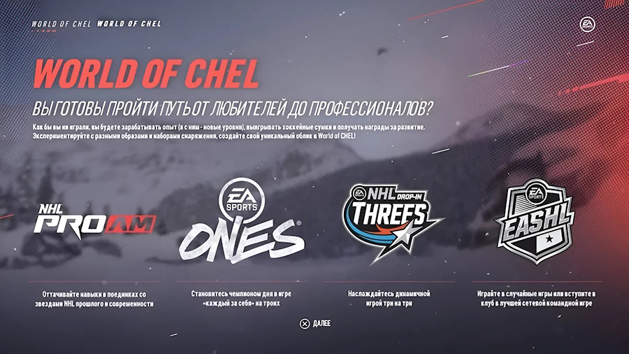
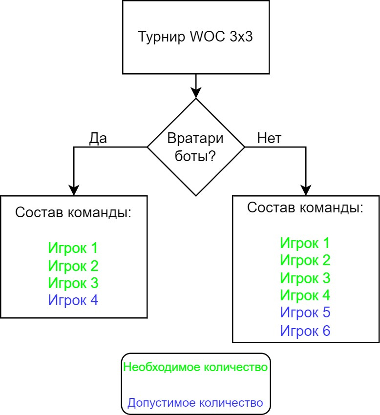
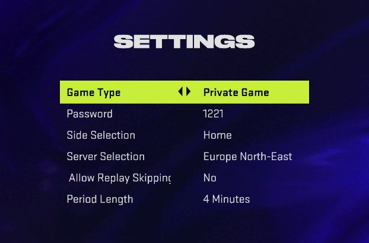
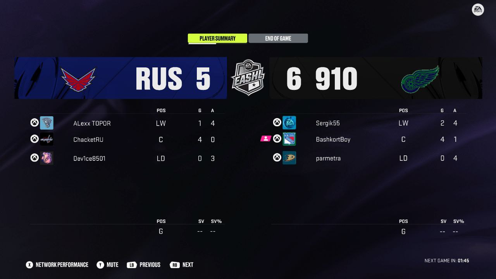
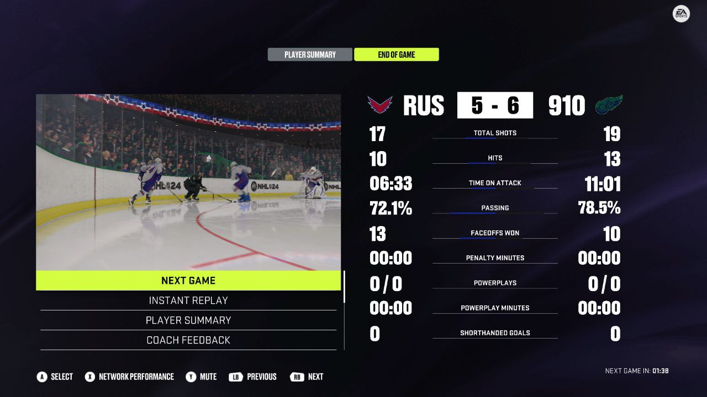

# Регламент турниров по виртуальному хоккею в режиме World of CHEL (WoC / CHEL)

## Введение

Основная часть правил наследуется из [основного регламента турниров CYBER-ICE.RU](/nhl/nhl.md).

> Турнир проводится в версиях игры для Xbox Series X|S и PlayStation 5 (Current Gen).

## 1 Требования к командам и участникам

1.1 Название клуба в игре должно совпадать с названием команды.

1.2 Просьба предоставить логотип команды в виде картинки или ссылки на картинку. При отсутствии оного будет использована аббревиатура команды.

1.2.1 Лого команды может отличаться от того, что использовано в игре, но при этом не должно нарушать авторские права. То есть если вы берёте картинку из интернета в качестве эмблемы команды, у вас должно быть разрешение на её использование.

1.2.2 Если вы хотите использовать логотипы клубов КХЛ, ВХЛ, МХЛ и так далее, то необходимо запросить разрешение официального клуба на использование лого. Смотрите всю дополнительную информации в [Регламенте подачи заявки на признание команды официальным представителем организации в лиге CYBER-ICE.RU](/woc/official_team.md)

1.2.3 В противном случае вы можете сгенерировать картинку логотипа вашей команды с помощью нейросетей или найти в сети свободно-распространяемую картинку.

1.3. Название, аббревиатура и логотип команды не должны противоречить нормам морали и законам.

1.4. Участникам рекомендовано писать свои настоящие имена и фамилии на майках своего виртуального игрока. Если участник не желает раскрывать свои персональные данные, это право остаётся за ним. Данный пункт необходим для удобства комментаторов, чтобы не путаться во множестве _Jordan NHL_.

1.4.1 Если имя и/или фамилия виртуального игрока содержат оскорбительные слова на русском или английском языках, команда данного участника получает техническое поражение со счётом 0:5 в данном матче. Для подтверждения нарушения необходимо предоставить фото или видео, на которых чётко видно данное нарушение.

1.5 Создание клубов

1.5.1 Человек, создающий клуб <u>для участия в турнире</u>, становится его владельцем и может быть капитаном только своего клуба.

1.5.2 Владелец может также выступать за свой или иной клуб в качестве "рядового" игрока, а капитаном его клуба может быть другой человек с разрешения владельца.

1.5.3 В рамках одной части игры игрок может быть владельцем только одного клуба, название и логотип которого закрепляются за ним на эту часть игры с момента подачи заявки на участие в турнире.

1.5.3.1 Например, если человек создал клуб "SuperTeam" (соответственно, стал владельцем этого клуба) и <u>подал заявку на участие в турнире NHL25</u>, то он не сможет стать капитаном другой команды, даже если удалит свой клуб и захочет создать новый с другим названием. Поэтому ему придётся либо пересоздать этот же клуб с изначальным названием ("SuperTeam") в случае удаления; либо дождаться новой части игры, чтобы быть владельцем и капитаном в новой команде; либо играть в качестве обычного игрока (не капитана).

1.5.3.2 Исключение из этого правила возможно, если игрок, будучи владельцем, становится капитаном официально подтверждённого клуба (см. пункт 1.2.2).

1.5.3.3 Допускается пересоздание клуба с целью точечного изменения в названии, заранее предупредив об этом Администрацию. Например, у вас был клуб "Buran", а вы решили добавить приписку "HC Buran", то такой вариант допустим, если в турнире ранее не участвовал клуб с таким названием (чтобы не было путаницы). А если у вас команда "HC Admiral", а вы решили переименовать её в "HC Jokerit", то данный вариант не будет подходить под категорию точечного изменения названия.

## 2 Составы команд и трансферы

2.1. Количество игроков в команде определяется по следующей схеме исходя из того, проводится сезон с вратарями-ботами или вратарями-людьми. Если сезон проходит по первому сценарию, то каждый играет на позиции полевого игрока, а на воротах бот. Если по второму, то ботов в матче быть не должно.

2.2.1 По ходу сезона допускаются трансферы, то есть когда можно игрока из одного клуба перевести в другой, добавить в команду нового участника или исключить из команды.

2.2.2 Количество трансферов на время одного сезона равняется 5.

2.2.3 Трансфером считается действие, когда происходит подписание игрока в команду из числа свободных агентов или вследствие перехода из другой команды. Исключение из команды не расходует количество трансферов.

2.2.4 Трансферы можно проводить во время группового этапа, пока остается несыгранным хотя бы один матч от всех игр регулярного чемпионата. Как только в групповом этапе будут завершены все игры, трансферное окно для всех команд станет закрыто.

2.2.5.1 Трансферы должны быть согласованы с Администрацией и объявлены публично в чате. Только после этого действия участники могут играть за команду.

2.2.5.2 Если Администрация не выходит на связь в течение 60 минут, то тогда необходимо объявить публично о трансфере в чате, а также предъявить скриншот, что прошёл час, и Администрация ещё не согласовала вам переход. И если у команды лимит переходов не исчерпан, то тогда этот трансфер считается произведённым успешно.

## 3 Позиции и раскладки

3.1. Участники вправе менять свои позиции игроков в каждом матче, выбирая между центральным нападающим, крайним нападающим, защитником и вратарём (если сезон проводится с вратарями-людьми).

3.2. Начиная с NHL 25, будут разрешены все способности (перки) в том числе, что были ранее запрещены. Данный пункт может быть изменён по итогам голосования в конце сезона.

## 4 Настройки и правила матчей

4.1. Если в турнире играет менее 9 команд, то каждая команда против другой играет 4 матча: 2 дома, 2 в гостях. Если команд 9 и более, то количество игр в групповом этапе составляет две: 1 дома, 1 в гостях.

4.2 Настройки матча должны быть следующими:

-   **Game Type** - Private Game
-   **Password** - Капитаны договариваются между собой о пароле
-   **Side Selection** - Капитаны договариваются между собой, кто начнёт дома, а кто в гостях
-   **Server Selection** - Капитаны договариваются между собой о выборе ближайшего сервера, но чаще всего ставят Europe North-East или Europe North
-   **Allow Replay Skipping (Разрешить пропуск повторов)** - Капитаны договариваются между собой, но рекомендовано ставить в значение No, когда будет вестись и комментироваться прямая трансляция матча
-   **Period Length** - 4 минуты
-   **Grudge Match Game** - Капитаны договариваются между собой, но рекомендовано ставить **No**

    

4.3. К матчу допускаются только команды в полном составе. Боты на льду играть не должны (кроме вратарей, если сезон проводится с вратарями-ботами).

4.4.1.1 Если в команде произошёл обрыв соединения у игрока, то с этого момента матч не продолжается и должен быть остановлен, пока на льду находится бот (за исключением вратаря, если сезон проводится с вратарями-ботами).

4.4.1.2 После обрыва соединения должны быть зафиксированы время, счёт команд и статистика игроков.

4.4.1.3 Примеры случаев засчитывания и не засчитывания голов после вылета смотрите в документ [World of CHEL. Приложение А](/woc/examples_a)

4.4.2 Если произошёл обрыва соединения игры или игрока, то матч должен быть перезапущен, чтобы на льду были все люди, но с учётом сыгранного времени и счёта, а также к этому матчу будет добавлено 5:00 минут игрового времени, чтобы компенсировать последние 60 секунд третьего периода, которые длятся 60 секунд реального времени.

4.4.2.1 Так как длительность периода устанавливается на 4 минуты реального времени, что эквивалентно 20 минутам игрового времени, то получается, что 1 минута реального времени = 5 минутам игрового времени.

4.4.2.2 Поэтому если вылет происходит в третьем периоде на последних шестидесяти секундах (которые идут в реальном времени), то после перезапуска количество игровых секунд, которое нужно будет доиграть, рассчитывается по формуле: `(количество-оставшихся-секунд-реального-времени × 5)`.

4.4.3 Допускается за игру три обрыва соединения со стороны каждой команды. Если это число превышает, команде ставится Техническое поражение.

4.5.1 После завершения игры победившая команда должна прислать в чат две фотографии: на первой должна быть статистика игроков обеих команд за матч, а на втором статистика команд за матч. Пример фотографий ниже:

Результаты матча, два скриншота <i>(клик)</i>

 

4.5.2 Если в матче разница в счёте составила 1 шайбу (например, 5:6), то необходимо подписать, в какое время закончилось противостояние - в основное или овертайм.

4.5.3 Если победившая команда отправляет результаты матча, на которых не видно статистику соперника, то в таком случае капитану этой команды делается предупреждение, а персональные результаты в этом матче не вносятся никому.

4.5.4 Если команды не предоставляют фотографии результатов, то в таком случае будут внесены только итоги матча, но не персональная статистика игроков.

## 5 Назначение матчей

5.1.1.1 Капитанам нужно договариваться о матчах с другими капитанами через личные сообщения. Исключительно переписки между капитанами будут использованы в случае возникновения запросов на ТП или других спорных ситуаций.

5.1.1.2 Переписки с менеджерами команды, ассистентами, массажистами и другими участниками клуба учитываться не будут. Ответственным за назначение матчей и получение штрафов является капитан команды.

5.1.2 Капитаны команд, после достижения договоренности о матчах, передают следующую информацию в чат турнира:

- Дата и время проведения матчей
- Количество игр, запланированных на указанное время

5.1.3 Если количество игр не было указано при договоренности, по умолчанию считается, что запланированы две игры.

5.2.1 Время ожидания другой команды составляет 15 минут.

5.2.2 Например, капитаны согласовали начать игру в 20:00. Команда А готова и ждёт команду Б. Если команда Б задерживается на 15 минут и более, то в этом матче команде Б присуждается техническое поражение, если команда А затребует такой исход.

5.3 Если матч уже согласован, то перенести на другое время/дату можно не менее, чем за 2 часа до начала игры, либо с взаимного согласия обоих капитанов.

5.4 Если команда начинает матч с игроком, имени и никнейма которого нет в составе команды, то в этом матче такая команда получает ТП. Если у обеих команд такое нарушение, то матч засчитан не будет и требуется переигровка. Поэтому если у вас новый игрок в составе, то необходимо подписать его в команду - делается это через Администрацию; подробнее в пунктах 2.2.\*.

5.5 Прямые трансляции матчей

5.5.1 Прямые трансляции игр в регулярном чемпионате рекомендуются, но не являются обязательными.

5.5.2 Все игры плей-офф **обязательно** должны транслироваться на любой видео-платформе. Ссылка на трансляцию должна быть передана в общий чат турнира до начала.

5.5.3 Если обе команды не желают включать стрим, то обязанность по запуску прямой трансляции возлагается на команду, играющую дома.

5.5.4 Если прямая трансляция во время плей-офф отсутствовала, то матчи должны быть переиграны. Либо капитаны каждой из команд должны предоставить веское обоснование отсутствия стрима.

## 6 Ограничения для капитанов и команд

6.1 Капитаны команд не могут покинуть команду или перейти в другой клуб во время действующего сезона. Поэтому если вы перед стартом турнира берёте на себя ответственность лидера клуба, то необходимо довести сезон до конца.

6.2.1 Капитаны, чья команда снялась с турнира или была дисквалифицирована, не могут в следующем сезоне принять участие как в роли капитана, так и в роли игрока. Ограничение: на 1 сезон.

6.2.2 Команды (название, аббревиатура и логотип), которые снялись с турнира или были дисквалифицированы, не могут принять участие в следующем сезоне. Ограничение: на 1 сезон.

6.2.3 В случае повторного снятия команды с турнира, на капитана и клуб накладывается ограничение на 2 сезона, в следующий раз на 3 сезона и так далее.

6.2.4 Ограничение на игроков, кроме капитана, кто был в этой команды, не распространяется.

6.3 При попытке обойти ограничения путём создания второго аккаунта на участника будет наложен постоянный запрет на участие во всех дальнейших турнирах.

## 7 Модифицированные временные рамки

### 7.1 Календарь игр

7.1.1 Перед началом сезона составляется календарь матчей, по которому команды должны проводить свои игры.

7.1.2 Календарь разделён на игровые недели продолжительностью 7 дней.

7.1.3 Если матч не сыгран в установленный срок:

- 7.1.3.1 Если матч, запланированный на текущую неделю, не состоялся до её конца, обе команды получают ТП (техническое поражение) 0:0.

- 7.1.3.2 Если одна из команд предоставит доказательства (например, скриншоты), что соперник уклонялся от игры, то виновной команде начисляется ТП 0:5.

- 7.1.3.3 Команды могут договориться о переносе матча <ins>**только на одну неделю вперёд**</ins>, но об этом нужно заранее уведомить Администрацию. Если игра не будет сыграна и после переноса, повторно её перенести будет нельзя, и будет начислено ТП согласно п. 7.1.3.1 или 7.1.3.2.

7.1.4 Администрация обязана напомнить командам в среду и в последний день игровой недели (пятницу) о несыгранных матчах. У капитанов есть время до полуночи дедлайна, чтобы:

- Договориться с соперником и сыграть матч в этот день.
- Предоставить доказательства своей активности, что соперник не соглашался на игру (п. 7.1.3.2).
- Согласовать перенос матча (п. 7.1.3.3).

Если этого не сделано, в полночь будет выставлено ТП (0:0) по п. 7.1.3.1.

7.1.5 После выставления в полночь дедлайна ТП (0:0) претензии от команд не принимаются. Так как они были предупреждены в среду и в пятницу, и имели более 12 часов, чтобы уведомить Администрацию о положении дел (пункты 7.1.3.2 и 7.1.3.3).

### 7.2 Лимит ТП

7.2.1 Если по ходу сезона или в его конце у команды набирается 30% ТП от всех её матчей в регулярке, то она получает дисквалификацию в текущем и следующем сезоне + соответствующие санкции для капитана. На рядовых игроков команды санкции не применяются.

7.2.1.1 Дисквалификация в текущем сезоне: на оставшиеся матчи команды будут проставлены ТП 0:5, если у неё на момент дисквалификации в турнирной таблице имелось 50% игр. В противном случае команда удаляется из таблицы, а результаты игр аннулируются.

7.2.1.2 Дисквалификация в следующем сезоне: см. пункт 6.2.1 и 6.2.2