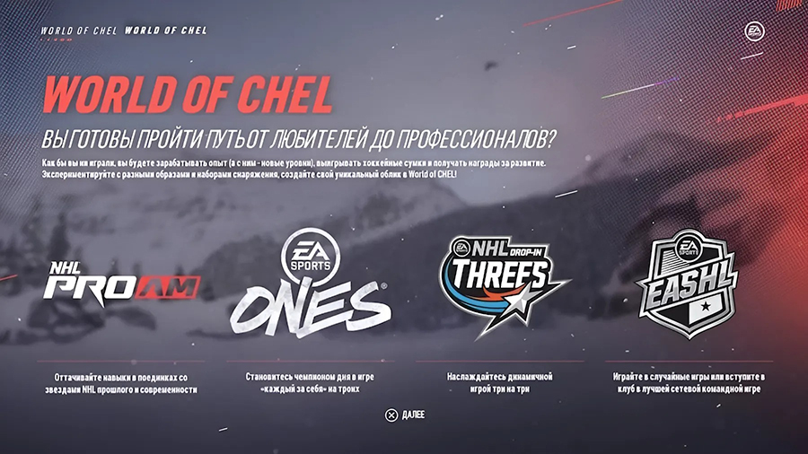
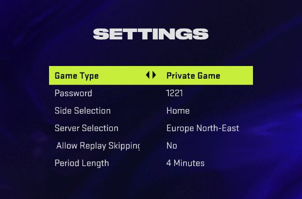
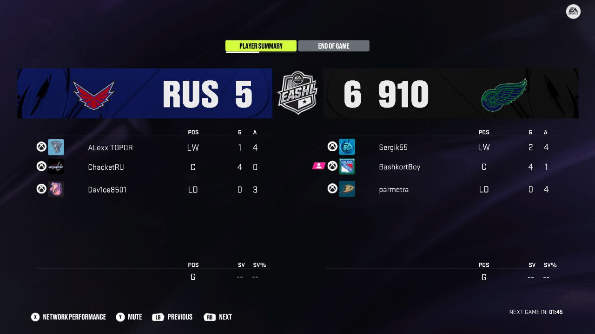
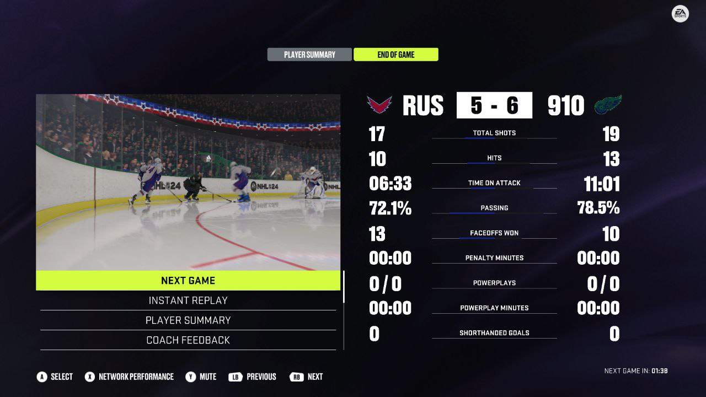

# Регламент турниров по виртуальному хоккею в режиме World of CHEL (WoC / CHEL)

## Введение

Основная часть правил наследуется из [основного регламента турниров CYBER-ICE.RU](/nhl/nhl.md).

Судья по активности опирается на [Регламент начисления очков активности при разборе споров о ТП](/woc/activity.md).

Судья по дисциплине опирается на [Регламент дисциплинарных мер за нарушения поведения](/woc/discipline.md).

> Турнир проводится в версиях игры для Xbox Series X|S и PlayStation 5 (Current Gen).

## 1 Требования к командам и участникам

1.1 Название клуба в игре должно совпадать с названием команды.

1.2 Просьба предоставить логотип команды в виде картинки. При отсутствии оного будет использована аббревиатура команды.

1.2.1 Лого команды может отличаться от того, что использовано в игре, но при этом не должно нарушать авторские права. То есть если вы берёте картинку из интернета в качестве эмблемы команды, у вас должно быть разрешение на её использование.

1.2.2 Если вы хотите использовать логотипы реальных хоккейных клубов или других организаций, то необходимо запросить разрешение у официального лица на использование лого. Смотрите всю дополнительную информации в [Регламенте подачи заявки на признание команды официальным представителем организации в лиге CYBER-ICE.RU](/woc/official_team.md)

1.3 Названия команд, их аббревиатуры и логотипы должны соответствовать принципам спортивной этики и взаимного уважения. Запрещено использование наименований и символики, содержащих оскорбительные, нецензурные, дискриминационные элементы, а также любые формы скрытых или явных подколов, иронии и провокаций в адрес соперников. Администрация вправе отклонить регистрацию команды при несоответствии данным требованиям.

1.4 Требования к именам игровых персонажей

1.4.1 Участникам настоятельно рекомендуется указывать на джерси свои настоящие имя и фамилию. Если участник не желает раскрывать персональные данные или сомневается в корректности и уместности выбранной надписи, он должен использовать нейтральное имя своего игрока или стандартное — Jordan NHL.

1.4.2 Имена и фамилии виртуальных игроков на джерси не должны содержать оскорбительных, нецензурных, дискриминационных выражений, провокаций или насмешек в отношении соперников на любых языках.

1.4.3 При выявлении нарушений данных пунктов во время игрового процесса команде нарушителя засчитывается техническое поражение со счётом 0:5 в данном матче. Для фиксации нарушения необходимо предоставить фото- или видеоматериалы, на которых чётко виден факт несоблюдения правил.

1.4.4 За неоднократное нарушение данного правила игрок может быть полностью отстранен от дальнейшего участия в турнире за систематическое неспортивное поведение.

1.5 Требования к внешнему виду командных форм

1.5.1 Домашняя форма должна быть контрастного и насыщенного цвета, чтобы обеспечивать хорошую видимость на льду.

1.5.2 Гостевая форма должна быть светлого цвета (например, белого) с цветными вставками, чтобы не сливаться со льдом и отличаться от домашней формы соперника.

1.5.3 В случае конфликта цветов форм (слишком похожи на формы оппонента) команда-хозяин обязана использовать альтернативный комплект.

1.5.4 Для разрешения иных вопросов по форме необходимо обратиться к Администрации.

## 2 Дивизионы, составы команд и трансферы

### 2.1 Дивизионы

2.1.1 В рамках турнира команды могут быть распределены на дивизионы в зависимости от уровня мастерства и игрового опыта участников:

- **Серебряный дивизион** предназначен для коллективов и игроков любительского уровня, стремящихся развить свои навыки и получить соревновательный опыт.

- **Золотой дивизион** предусмотрен для сыгранных команд и опытных игроков продвинутого уровня, демонстрирующих стабильные игровые показатели и готовых к конкурентной борьбе.

2.1.2 Распределение команд по всем дивизионам осуществляется под надзором и контролем **Судейской коллегии по распределению игроков**. Процедура распределения регулируется следующими положениями:

2.1.2.1 В заключительный день регистрации команд Судейская коллегия рассматривает пожелания (предпочтения) коллективов по выбору дивизиона, указанные ими при подаче заявки на турнир.

2.1.2.2 Судейская коллегия проводит обязательный глубокий анализ заявленного состава каждой команды. Решение о допуске в тот или иной дивизион принимается на основе достижений игроков в прошлых турнирах (в том числе и в других лигах), а также на базе действующей рейтинговой системы.

2.1.2.3 По результатам анализа Судейская коллегия вправе как утвердить команду в желаемом дивизионе, так и перевести её в более высокий дивизион, соответствующий реальному уровню мастерства её участников. Если команда не согласна с переводом в другой дивизион, она обязаны озвучить своё решение не принимать участие в текущем турнире (иными словами - сняться с турнира до его начала, чтобы не получить санкции). Озвучить решение нужно в течение 30 минут после оглашения Судейской коллегией. По истечении указанного времени начинается процедура формирования календаря матчей, и последующий отказ от участия приравнивается к досрочному снятию с турнира по ходу сезона.

2.1.2.4 Данная мера направлена на соблюдение спортивного принципа «равные играют с равными» и призвана исключить ситуации, при которых заведомо сильные команды записываются в дивизион не по своему уровню, нарушая соревновательный баланс турнира.

2.1.3 Судейская коллегия вправе отклонить заявки команд, которые превосходят уровень всех зарегистрировавшихся команд. Или также вправе инициировать отдельный дивизион для них.

2.1.4 Все не описанные в этом разделе вариации решаются судейской коллегией в рантайме. А в последствии вносятся в этот регламент как прецедент.

### 2.2 Состав команд

2.2.1 Количество игроков в составе команды определяется по следующей схеме в зависимости от формата турнира:
- 3v3: минимум 3 человека, максимум 6 человек
- 6v6: минимум 5 человек, максимум 10 человек

2.2.2 Боты в матчах:
- Если сезон с вратарями-ботами, то каждый играет только на позиции полевого игрока.
- Если сезон с вратарями-людьми, то ботов в матче быть не должно.

2.2.3 Ограничения состава для дивизионов:
- в формате 3v3: не более 1 игрока уровня дивизиона выше в составе команды;
- в формате 6v6: не более 2 игроков уровня дивизиона выше в составе команды.

2.2.4 Если одновременно проводятся турниры в разных дивизионах, участник может принимать участие только в одном из них.

### 2.3 Трансферы

2.3.1 По ходу сезона допускаются трансферы, то есть когда можно игрока из одного клуба перевести в другой, добавить в команду нового участника или исключить из команды.

2.3.2 Количество трансферов на время одного сезона равняется 5.

2.3.3 Трансфером считается действие, когда происходит подписание игрока в команду из числа свободных агентов или вследствие перехода из другой команды. Исключение из команды не расходует количество трансферов.

2.3.4 Трансферы можно проводить во время группового этапа, пока остается несыгранным хотя бы один матч от всех игр регулярного чемпионата. Как только в групповом этапе будут завершены все игры, трансферное окно для всех команд станет закрыто.

2.3.5 Подача и согласование

2.3.5.1 Максимальный дивизион

2.3.5.1.1 Подписание нового игрока в команду (или исключние из команды) осуществляется капитаном клуба или его ассистентами через официальное мини-приложение CYBER-ICE.RU самостоятельно.

2.3.5.2 Остальные дивизионы

2.3.5.2.1 Капитан или ассистент команды публикует заявку на трансфер в специальной теме официального чата турнира с указанием:

* имени игрока;
* никнейма игрока;
* названия команды.

2.3.5.2.2 Подписываемый игрок должен быть зарегистрирован на платформе CYBER-ICE.RU до подачи заявки; в противном случае заявка автоматически отклоняется и должна быть подана повторно после полноценной регистрации.

2.3.5.2.3 Трансфер считается согласованным после подтверждения Администрацией и публичного объявления в чате. Только после этого игрок имеет право выступать за команду.

2.3.5.2.4 Заявка подлежит обязательному рассмотрению специальной судейской коллегией в срок до 24 часов на предмет соответствия пункту 2.1.3. По итогам коллегия направляет решение Администрации, которая проводит трансфер либо отклоняет его (при отклонении указывается причина).

## 3 Позиции и раскладки

3.1. Участники вправе менять свои позиции игроков в каждом матче, выбирая между центральным нападающим, крайним нападающим, защитником и вратарём (если сезон проводится с вратарями-людьми).

3.2. Формат использования способностей (перков) определяется голосованием капитанов по завершении каждого сезона. Утвержденный формат фиксируется в описании турнира до старта регистрации и не меняется на протяжении всего следующего сезона.

## 4 Настройки и правила матчей

4.1. Количество матчей между командами в регулярном сезоне устанавливает Администрация после закрытия регистрации и утверждения окончательного списка команд. По умолчанию — два матча (дома и в гостях), но при необходимости, с учётом числа команд, количество игр может отличаться.

4.2 Настройки матча должны быть следующими:

-   **Game Type** - Private Game
-   **Password** - Капитаны договариваются между собой о пароле
-   **Side Selection** - Капитаны договариваются между собой, кто начнёт дома, а кто в гостях
-   **Server Selection** - Команда, играющая дома, выбирает сервер (из пула Europe-серверов). Но по взаимному согласию капитаном может быть установлен иной сервер
-   **Allow Replay Skipping (Разрешить пропуск повторов)** - Капитаны договариваются между собой, но рекомендовано ставить в значение No, когда будет вестись и комментироваться прямая трансляция матча
-   **Period Length** - 4 минуты
-   **Grudge Match Game** - Капитаны договариваются между собой, но рекомендовано ставить **No**

    

4.3 К матчу допускаются только команды в полном составе. Боты на льду играть не должны (кроме вратарей, если сезон проводится с вратарями-ботами).

4.4 Восстановление игры после обрыва соединения

Если в команде произошёл обрыв соединения у игрока, то с этого момента матч не продолжается и должен быть остановлен, пока на льду находится бот (за исключением вратаря, если сезон проводится с вратарями-ботами).

После обрыва соединения команды обязаны зафиксировать счёт, игровое время, статистику игроков, а также восстановить составы, которые были до обрыва соединения (замены игроков и смена позиций не допускается).

4.4.1 Составы и удаления

4.4.1.1 Если на момент обрыва у одной из команд было удаление, матч должен быть возобновлён с сохранением того же численного соотношения игроков на льду.

4.4.1.2 Для этого команда, игравшая в меньшинстве на момент обрыва, обязана сразу после стартового вбрасывания в доигровке совершить техническое удаление.

4.4.2 Тайм-ауты

4.4.2.1 Если команда использовала тайм-аут до обрыва соединения, повторное использование тайм-аута в рамках доигровки запрещено.

4.4.2.2 Нарушение данного правила по запросу команды-соперника может повлечь присуждение технического поражения.

4.4.3 Время доигровки

4.4.3.1 Матч возобновляется с сохранением счёта и сыгранного времени.

4.4.3.2 Дополнительно ко времени доигровки прибавляется 5:00 минут игрового времени для компенсации последних 60 секунд третьего периода, которые в игре проходят в реальном времени.

4.4.3.3 Если обрыв произошёл в последние 60 секунд третьего периода, объём доигрываемого времени рассчитывается по формуле:
`(оставшиеся секунды реального времени × 5)`.

4.4.4 Примеры случаев засчитывания и не засчитывания голов после вылета смотрите в документ [World of CHEL. Приложение А](/woc/examples_a)

4.5 Допускается за игру два обрыва соединения со стороны каждой команды. Если это число превышает, команде ставится Техническое поражение, если оппонент затребует такой исход.

## 5 Назначение матчей

5.1.1 Матчи турнира проводятся в 20:00 по московскому времени. Однако капитаны могут договориться друг с другом на любое другое удобное время. Но если компромисс не удаётся найти, то матчи должны быть сыграны в фиксированное время - 20:00 МСК. Это время является приоритетным при возникновении спорных ситуаций.

5.1.1.1 Капитанам нужно договариваться о матчах с другими капитанами через личные сообщения. Исключительно переписки между капитанами будут использованы в случае возникновения запросов на ТП или других спорных ситуаций.

5.1.1.2 Переписки с менеджерами команды, ассистентами, массажистами и другими участниками клуба учитываться не будут. Ответственным за назначение матчей и получение штрафов является капитан команды.

5.1.2 Капитаны команд, после достижения договоренности о матчах, передают следующую информацию в чат турнира:

- Дата и время проведения матчей
- Количество игр, запланированных на указанное время

5.1.3 Если количество игр не было указано при договоренности, по умолчанию считается, что запланирован один матч.

5.2 Ожидание команды соперника

5.2.1 Время ожидания команды исчисляется с официально согласованного времени начала матча.

5.2.2 Если команды согласовали начало серии матчей на 20:00, а одна из команд не готова к началу, другая команда обязана ожидать 15 минут.

5.2.3 Если по истечении 15 минут с официально согласованного времени начала матча команда не готова начать игру, готовая команда вправе потребовать присуждения технического поражения за данный матч. Капитан команды, требующей техническое поражение, обязан в этот же момент уведомить об этом капитана команды-соперника и Администрацию.

5.2.4 Если команды заранее согласовали проведение двух и более матчей подряд, каждый следующий 15-минутный интервал ожидания рассматривается как время ожидания очередного матча. В таком случае после истечения первых 15 минут готовая команда вправе потребовать техническое поражение за первый матч, после истечения следующих 15 минут — за второй матч, и далее по аналогии за каждый следующий матч серии. Капитан команды, требующей техническое поражение за очередной матч, обязан в момент заявления такого требования уведомить об этом капитана команды-соперника и Администрацию.

5.2.5 Если первый матч был сыгран, следующий матч должен быть начат не позднее 15 минут с момента его завершения, если капитаны заранее не согласовали иное время его начала.

5.2.6 В случае нарушения срока, установленного пунктом 5.2.5, применяется порядок, предусмотренный пунктами 5.2.3 - 5.2.4.

5.3 Если матч уже согласован, то перенести на другое время/дату можно не менее, чем за 2 часа до начала игры, либо с взаимного согласия обоих капитанов.

5.4 Если команда начинает матч с игроком, имени и никнейма которого нет в составе команды, то в этом матче такая команда получает ТП. Если у обеих команд такое нарушение, то матч засчитан не будет и требуется переигровка. Поэтому если у вас новый игрок в составе, то необходимо подписать его в команду - подробнее в пунктах 2.2.\*.

## 6 Ограничения для капитанов и команд

6.1 Капитаны команд не могут покинуть команду или перейти в другой клуб во время действующего сезона. Поэтому если вы перед стартом турнира берёте на себя ответственность лидера клуба, то необходимо довести сезон до конца.

6.2.1 Капитаны, чья команда снялась с турнира или была дисквалифицирована, не могут в следующих сезонах принять участие как в роли капитана, так и в роли игрока. Подробнее: [Временные рамки, контроль активности и штрафные санкции, раздел 7](/activity_and_penalties/activity_and_penalties.md).

6.2.2 Команды (название, аббревиатура и логотип), которые снялись с турнира или были дисквалифицированы, не могут принять участие в следующих сезонах. Подробнее: [Временные рамки, контроль активности и штрафные санкции, раздел 7](/activity_and_penalties/activity_and_penalties.md).

6.2.3 Ограничение на игроков, кроме капитана, кто был в этой команды, не распространяется.

6.3 При попытке обойти ограничения путём создания второго аккаунта на участника будет наложен постоянный запрет на участие во всех дальнейших турнирах.

6.4 Легальный способ снятия санкций описан в документе [Временные рамки, контроль активности и штрафные санкции, раздел 8](/activity_and_penalties/activity_and_penalties.md).

## 7 Модифицированные временные рамки

### 7.1 Календарь игр

> Командам предстоит играть **минимум** 6-8 матчей в неделю (согласно календарю). Точное число игр в календаре определяется по итогам регистрации команд, но не должно выходить за указанные пределы.
>
> Можно сыграть игры с будущих недель, если оппонент тоже согласен.

7.1.1 Перед началом сезона составляется календарь матчей, по которому команды должны проводить свои игры.

7.1.2 Календарь разделён на игровые недели продолжительностью 7 дней.

7.1.3 Если матч не сыгран в установленный срок:

- 7.1.3.1 Если матч, запланированный на текущую неделю, не состоялся до её конца, обе команды получают ТП (техническое поражение) 0:0.

- 7.1.3.2 Если одна из команд предоставит доказательства (например, скриншоты), что соперник уклонялся от игры, то виновной команде начисляется ТП 0:5.

- 7.1.3.3 Команды могут договориться о переносе матча <ins>**только на одну неделю вперёд**</ins>, но об этом нужно заранее уведомить Администрацию. Если игра не будет сыграна и после переноса, повторно её перенести будет нельзя, и будет начислено ТП согласно п. 7.1.3.1 или 7.1.3.2.

7.1.4 Администрация обязана напомнить командам в среду и в последний день игровой недели (пятницу) о несыгранных матчах. У капитанов есть время до полуночи дедлайна, чтобы:

- Договориться с соперником и сыграть матч в этот день.
- Предоставить доказательства своей активности, что соперник не соглашался на игру (п. 7.1.3.2).
- Согласовать перенос матча (п. 7.1.3.3).

Если этого не сделано, в полночь будет выставлено ТП (0:0) по п. 7.1.3.1.

7.1.5 После выставления в полночь дедлайна ТП (0:0) претензии от команд не принимаются. Так как они были предупреждены в среду и в пятницу, и имели более 12 часов, чтобы уведомить Администрацию о положении дел (пункты 7.1.3.2 и 7.1.3.3).

### 7.2 Лимит ТП

7.2.1 Если по ходу сезона или в его конце у команды набирается 30% ТП от всех её матчей в регулярке, то она получает дисквалификацию в текущем и следующем сезоне + соответствующие санкции для капитана. На рядовых игроков команды санкции не применяются.

## 8 Добавление результатов матчей

После завершения каждого матча нужно выполнить следующие шаги:

### 8.1 Добавление фото-итогов в чат турнира

8.1.1 После завершения игры победившая команда должна прислать в чат две фотографии: на первой должна быть статистика игроков обеих команд за матч, а на втором статистика команд за матч. Пример фотографий ниже:

Результаты матча, два скриншота <i>(клик)</i>

 

8.1.2 Если счёт отличается ровно на одну шайбу (например, 5:6), добавьте комментарий, указав, был ли матч завершён в основное время или в овертайме.

8.1.3 Если победившая команда отправляет результаты матча, на которых нет статистики игроков своей команды и/или соперника, то в таком случае персональные результаты в этом матче не вносятся никому; только счёт команд (кроме случаев загрузки результатов с серверов EA).

### 8.2 Добавление итогов через мини-приложение

8.2.1 В обязанности капитанов команд входит внесение результата матча через мини-приложение в турнирную таблицу.

8.2.2 Если матч был сыгран от начала и до конца без потери соединения всех игроков, то этот результат можно подгрузить с API сервера EA Sports (вместе с итогами команд и статистикой игроков). Обычно он доступен в течение 5 минут после завершения игры.

8.2.3 Если же в матче был вылет, то капитан должен вручную по скриншотам внести счет команд и статистику игроков (голы, ассисты и сейвы).

## 9 Плей-офф

В плей-офф команды играют серию Best of 5 (до 3-х побед).
