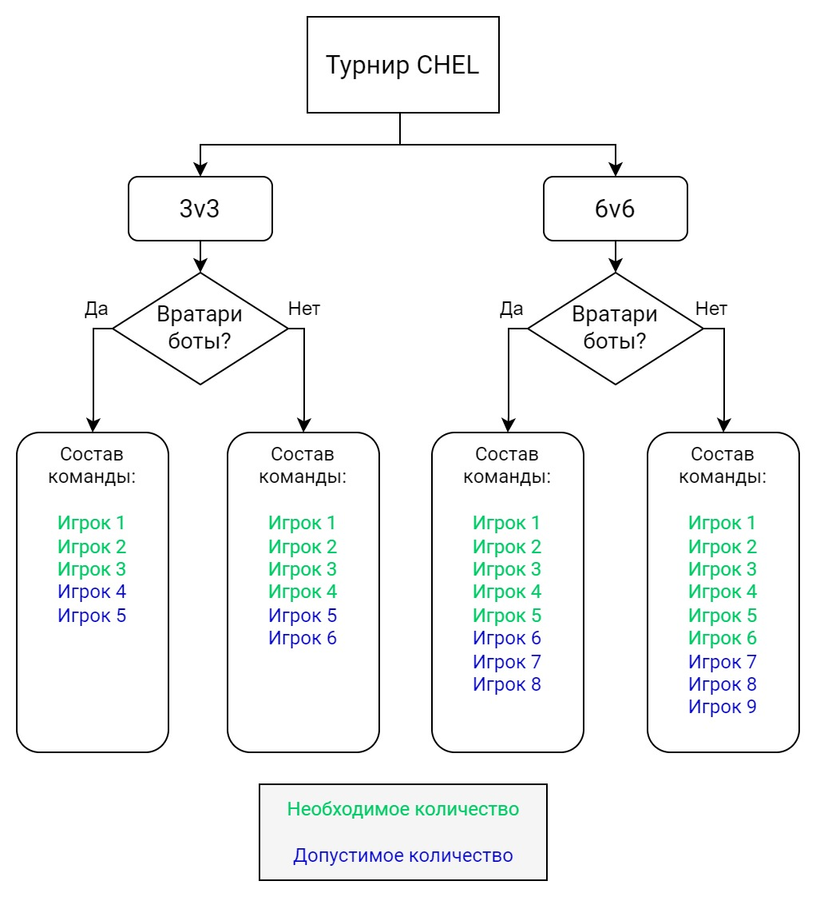
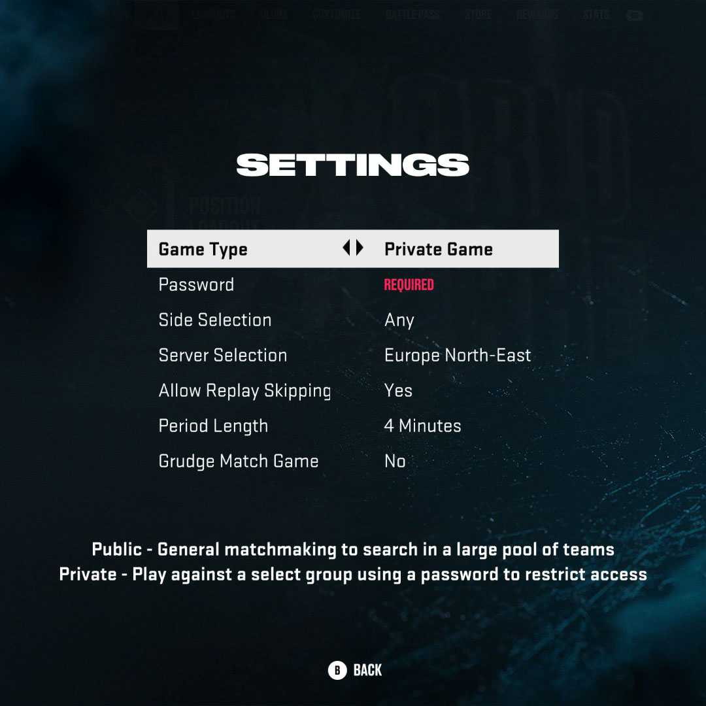

# Регламент турниров по виртуальному хоккею в режиме World of CHEL (WoC / CHEL)

## Введение

Основная часть правил наследуется из [основного регламента турниров XBOXNHL](/nhl/nhl.md).

> Турнир проводится в версиях игры для Xbox One и PlayStation 4 (Past Gen).

## 1 Требования к командам и участникам

1.1 Название клуба в игре должно совпадать с названием команды.

1.2 Просьба предоставить логотип команды в виде картинки или ссылки на картинку. При отсутствии оного будет использована аббревиатура команды.

1.2.1 Лого команды может отличаться от того, что использовано в игре, но при этом не должно нарушать авторские права. То есть если вы берёте картинку из интернета в качестве эмблемы команды, у вас должно быть разрешение на её использование.

1.2.2 Если вы хотите использовать логотипы клубов КХЛ, ВХЛ, МХЛ и так далее, то необходимо запросить разрешение официального клуба на использование лого. В таком случае ваша команда будет иметь статус подтверждённой команды.

1.2.3 В противном случае вы можете сгенерировать картинку логотипа вашей команды с помощью нейросетей или найти в сети свободно-распространяемую картинку.

1.3. Название, аббревиатура и логотип команды не должны противоречить нормам морали и законам.

1.4. Участникам рекомендовано писать свои настоящие имена и фамилии на майках своего виртуального игрока. Если участник не желает раскрывать свои персональные данные, это право остаётся за ним. Данный пункт необходим для удобства комментаторов, чтобы не путаться во множестве _Jordan NHL_.

## 2 Составы команд и трансферы

2.1. Количество игроков в команде определяется по следующей схеме исходя из того, проводится сезон с вратарями-ботами или вратарями-людьми. Если сезон проходит по первому сценарию, то каждый играет на позиции полевого игрока, а на воротах бот. Если по второму, то ботов в матче быть не должно.

2.2.1 По ходу сезона допускаются трансферы, то есть когда можно игрока из одного клуба перевести в другой, добавить в команду нового участника или исключить из команды.

2.2.2 Количество трансферов на время одного сезона равняется 5.

2.2.3 Трансфером считается действие, когда происходит подписание игрока в команду из числа свободных агентов или вследствие перехода или обмена из другой команды. Исключение из команды не расходут количество трансферов.

2.2.4 Трансферы можно проводить во время группового этапа, пока остается несыгранным хотя бы один матч от всех игр регулярного чемпионата. Как только в групповом этапе будут завершены все игры, трансферное окно для всех команд станет закрыто.

2.2.5.1 Трансферы должны быть согласованы с Администрацией и объявлены публично в чате. Только после этого действия участники могут играть за команду.

2.2.5.2 Если Администрация не выходит на связь в течение 60 минут, то тогда необходимо объявить публично о трансфере в чате, а также предъявить скриншот, что прошёл час, и Администрация ещё не согласовала вам переход. И если у команды лимит переходов не исчерпан, то тогда этот трансфер считается произведённым успешно.

## 3 Позиции и раскладки

3.1. Участники вправе менять свои позиции игроков в каждом матче, выбирая между центральным нападающим, крайним нападающим, защитником и вратарём (если сезон проводится с вратарями-людьми).

3.2. Использовать можно любые раскладки и способности, кроме тех, что изображены на рисунке ниже. Данные способности нельзя брать ни Золотые, ни Серебряные. Перед началом матча капитаны должны проверить отсутствие данных способностей у своих игроков. Если матч начался и было произведено стартовое вбрасывание, то считается, что произошло нарушение данного пункта и команде присуждается ТП в текущем матче. Если у обеих команды нарушение этого пункта, то матч не будет засчитан и требуется переигровка.

## 4 Настройки и правила матчей

4.1. Если в турнире играет менее 10 команд, то каждая команда против другой играет 4 матча: 2 дома, 2 в гостях. Если команд 10 и более, то количество игр в групповом этапе составляет две: 1 дома, 1 в гостях.

4.2 Настройки матча должны быть следующими:

-   **Game Type** - Private Game
-   **Password** - Капитаны договариваются между собой о пароле
-   **Side Selection** - Капитаны договариваются между собой, кто начнёт дома, а кто в гостях
-   **Server Selection** - Капитаны договариваются между собой о выборе ближайшего сервера, но чаще всего ставят Europe North-East или Europe North
-   **Allow Replay Skipping (Разрешить пропуск повторов)** - Капитаны договариваются между собой, но рекомендовано ставить в значение No, когда будет вестись и комментироваться прямая трансляция матча
-   **Period Length** - 4 минуты

-   

    
<i>Скриншот настроек матча (клик)</i>

    

    

4.3. К матчу допускаются только команды в полном составе. Боты на льду играть не должны (кроме вратарей, если сезон проводится с вратарями-ботами).

4.4.1.1 Если у команды из игры вылетел игрок, то с того момента матч не продолжается и должен быть сразу же остановлен, пока на льду есть бот (кроме вратаря, если сезон проводится с вратарями-ботами). 

4.4.1.2 Если сезон проводится с вратарями-людьми, и у партнёра произошел обрыв соединения, то в первую очередь необходимо выйти из игры вратарю, чтобы матч завершился как можно скорее. Если сезон с вратарями-ботами, то нужно выйти любому партнёру - и тогда матч тоже завершится.

4.4.1.3 У бота нет круга выносливости под игроком - именно так можно понять, что это не человек. Фиксируйте время и счёт и выходите из матча, чтобы продолжить в полном составе с учётом сыгранного времени и счёта.

4.4.1.4 Примеры случаев засчитывания и не засчитывания голов после вылета.

4.4.1.4.1 Игрок команды A убегает "один-в-ноль" или исполняет буллит до вылета игрока из команды B или из команды A, находясь на корпус впереди оппонентов, то есть никто не оказывает давления со стороны соперников, а у команды B или A вылетает игрок в этот момент, и игрок команды A забивает гол, то такой гол будет засчитан, так как вылет игрока никак не помешал атаке "один-в-ноль" или буллиту.

4.4.1.4.2 У команды B вылетел игрок в момент, когда шла атака команды B, но партнёры по команде продолжили атакующие действия, а игроки команды A остановились, то такой гол **НЕ** будет засчитан.

4.4.1.4.3 У команды B вылетел игрок в момент, когда шла атака команды B, партнёры по команде остановились на месте и начали выходить из игры, а в этот момент игрок команды A отбирает шайбу и забивает гол, то такой гол **НЕ** будет засчитан.

4.4.1.4.4 У команды B вылетел игрок в момент, когда была оборона, партнёры по команде остановились на месте и начали выходить из игры, а в этот момент игрок команды A отбирает шайбу и забивает гол, то такой гол **НЕ** будет засчитан.

4.4.1.4.5 Если у команды B вылетел игрок, но обе команды продолжают действия атаки и обороны, то голы/ассисты, произошедшие в этот момент **НЕ** будут засчитаны, а перезапущенная игра будет продолжена не с того момента, когда вылетел игрок, а с того, когда оборвётся матч. Поэтому не нужно тянуть время, а лучше выйти, как можно раньше, если у вашего партнёра случился обрыв соединения.

4.4.1.4.6 Примеров может быть бесконечное количество, но это самые распространённые варианты. Для других случаев включайте стрим ваших игр и сохраняйте записи для разбирательств спорных моментов. В ином случае Администрация не сможет рассудить команды, и надо будет только переигрывать матч заново.

4.4.2 Если произошёл вылет игры или игрока, то матч должен быть перезапущен, чтобы на льду были все люди, но с учётом сыгранного времени и счёта, а также к этому матчу будет добавлено 5:00 минут игрового времени, чтобы компенсировать последние 60 секунд третьего периода, которые длятся 60 секунд реального времени.

4.4.2.1 Так как длительность периода устанавливается на 4 минуты реального времени, что эквивалентно 20 минутам игрового времени, то получается, что 1 минута реального времени = 5 минутам игрового времени.

4.4.2.2 Поэтому если вылет происходит в третьем периоде на последних шестидесяти секундах (которые идут в реальном времени), то после перезапуска количество игровых секунд, которое нужно будет доиграть, рассчитывается по формуле: `(количество-оставшихся-секунд-реального-времени × 5)`.

4.4.3 Допускается за игру три обрыва соединения со стороны каждой команды. Если это число превышает, команде ставится Техническое поражение.

4.5.1 После завершения игры победившая команда должна прислать в чат две фотографии: на первой должна быть статистика игроков обеих команд за матч, а на втором статистика команд за матч. Пример фотографий ниже:

<i>Результаты матча, два скриншота (клик)</i>

 

4.5.2 Если в матче разница в счёте составила 1 шайбу (например, 5:6), то необходимо подписать, в какое время закончилось противостояние - в основное или овертайм.

## 5 Назначение матчей

5.1 Капитаны команд должны договориться между собой о дате, времени и количестве матчей, которые сыграют в обговоренное время, и передать эту информацию в чат турнира.

5.2.1 Время ожидания другой команды составляет 15 минут.

5.2.2 Например, капитаны согласовали начать игру в 20:00. Команда А готова и ждёт команду Б. Если команда Б задерживается на 15 минут и более, то в этом матче команде Б присуждается техническое поражение, если команда А затребует такой исход.

5.3 Если матч уже согласован, то перенести на другое время/дату можно не менее, чем за 2 часа до начала игры, либо с взаимного согласия обоих капитанов.

5.4 Если команда начинает матч с игроком, имени и никнейма которого нет в составе команды, то в этом матче такая команда получает ТП. Если у обеих команд такое нарушение, то матч засчитан не будет и требуется переигровка. Поэтому если у вас новый игрок в составе, то необходимо подписать его в команду - делается это через Администрацию; подробнее в пунктах 2.2.\*.

## 6 Ограничения для капитанов и команд

6.1 Капитаны команд не могут покинуть команду или перейти в другой клуб во время действующего сезона. Поэтому если вы перед стартом турнира берёте на себя ответственность лидера клуба, то необходимо довести сезон до конца.

6.2.1 Капитаны, чья команда снялась с турнира или была дисквалифицирована, не могут в следующем сезоне принять участие как в роли капитана, так и в роли игрока. Ограничение: на 1 сезон.

6.2.2 Команды (название, аббревиатура и логотип), которые снялись с турнира или были дисквалифицированы, не могут принять участие в следующем сезоне. Ограничение: на 1 сезон.

6.2.3 В случае повторного снятия команды с турнира, то на капитана и клуб накладывается ограничение на 2 сезона, в следующий раз на 3 сезона и так далее.

6.2.4 Ограничение на игроков, кроме капитана, кто был в этой команды, не распространяется.

6.3 При попытке обойти ограничения путём создания второго аккаунта на участника будет наложен постоянный запрет на участие во всех дальнейших турнирах.