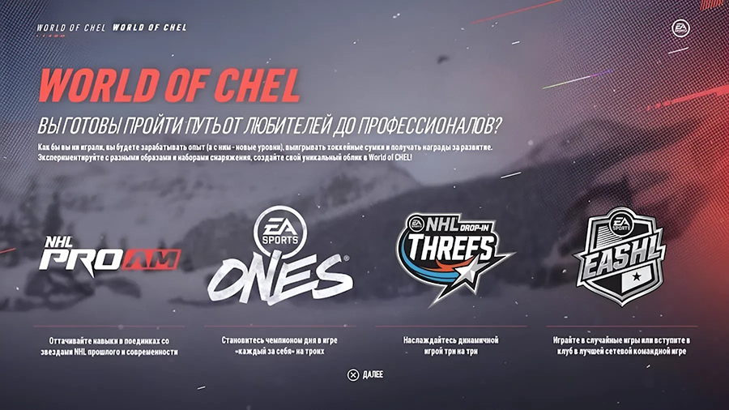
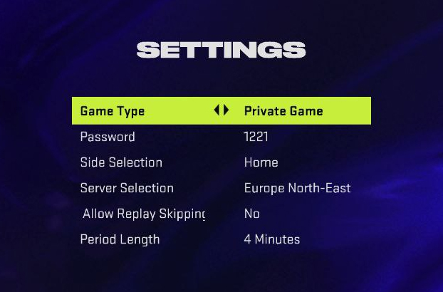
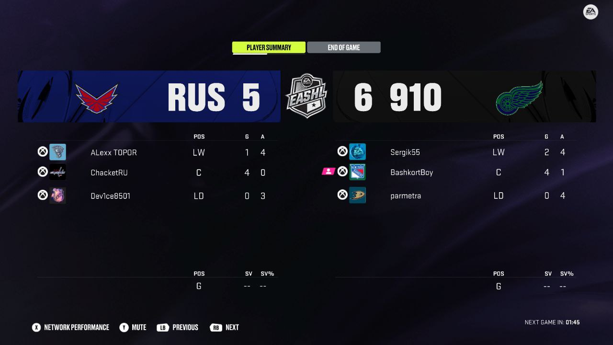
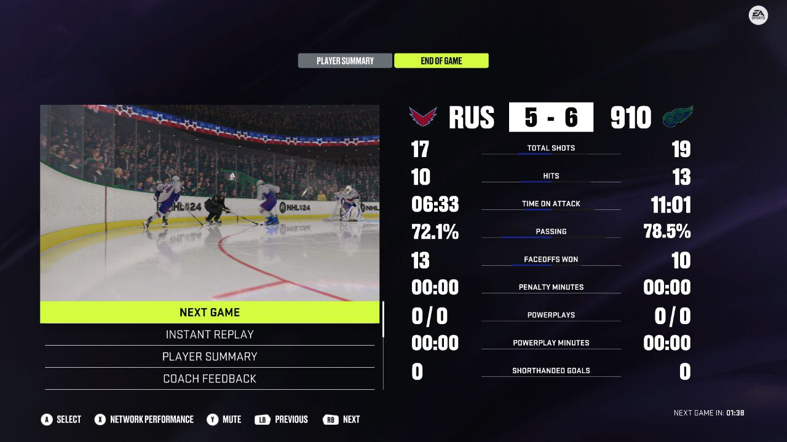

# Tournament Regulations for World of CHEL (WoC / CHEL) Virtual Hockey

## Introduction

The core rules are inherited from the [Main CYBER-ICE.RU Tournament Regulations](/nhl/nhl.md).

> The tournament is played on Xbox Series X|S and PlayStation 5 (current-gen versions).

## 1. Team and Player Requirements

1.1 The in-game club name must match the official team name.

1.2 Teams may provide a logo as an image file or a link to an image. If no logo is provided, the team abbreviation will be used by default.

1.2.1 The team logo may differ from the in-game version but must not violate any copyright. If an image from the internet is used as a team logo, the team must have permission to use it.

1.2.2 If a team intends to use logos of professional hockey clubs (e.g., KHL, VHL, MHL) or other organizations, you must get official permission. Full details can be found in the [Regulations for Applying to Represent an Official Organization in CYBER-ICE.RU](/woc/official_team.md).

1.2.3 Alternatively, teams may generate a custom logo using AI tools or find a free image online that does not have copyright.

1.3 Team names, short names, and logos must not include rude, offensive, or hateful words. They must follow laws and moral standards. The Administration can reject a team that breaks this rule.

1.4 Players are advised to use their real first and last names on their virtual jerseys. But this is optional.

1.4.1 If a player’s in-game name has offensive, rude, or hateful words (in Russian or English), the team will lose the match 0:5 or must replay the game. You must provide a clear screenshot or video as proof of the violation.

## 2. Team Rosters and Transfers

### 2.1 Team Rosters

2.1.1 The number of players in a team depends on the tournament format:
- 3v3: minimum 3 players, maximum 8 players
- 6v6: minimum 5 players, maximum 12 players

2.1.2 Bots in matches:
- If the season allows AI goalies, all players must play only as skaters (not goalies).
- If the season uses human goalies, then bots are not allowed in the match at all.

### 2.2 Transfers

2.2.1 Transfers are allowed during the season. This means you can move a player from one team to another, add a new player, or remove someone from the team.

2.2.2 Each team can make up to 5 transfers during one season.

2.2.3 A transfer is when a new player joins the team — either as a free agent or by moving from another team. Removing a player from the team does not count as a transfer.

2.2.4 Transfers can be made during the group stage, as long as there is at least one regular season match left to play. Once all group stage matches are finished, the transfer window closes for every team.

2.2.5.1 All transfers must be approved by the Administration and announced publicly in the chat. Only after this can the player take part in matches for the new team.

2.2.5.2 If the Administration does not reply within 60 minutes, you must do both:
- Announce the transfer publicly in the chat
- Send a screenshot proving there was no reply from the Administration within one hour

The transfer is accepted if the team has a free slot and still has at least one available transfer left (see rule 2.2.2).

2.2.5.3 Please try to make all transfers in advance — at least one hour before the match. This gives time for automatic approval if needed (see rule 2.2.5.2), especially when the Administration is offline.

## 3. Positions and Loadouts

3.1. Players are allowed to change their positions before each match. Possible positions include center, winger, defenseman, and goalie (if the season is played with human goalies).

3.2. Starting with NHL 25, all abilities (perks) are allowed, including those that were previously restricted. This rule may change based on a community vote at the end of the season.

## 4. Match Settings and Rules

4.1. If the tournament has fewer than 9 teams, each team plays 4 matches against every other team: 2 home games and 2 away games.  
If there are 9 or more teams, each team plays 2 matches against every other team: 1 home and 1 away.

4.2. Match settings must follow these rules:

- **Game Type** – Private Game  
- **Password** – Team captains agree on the password  
- **Side Selection** – Team captains agree who plays home and who plays away  
- **Server Selection** – Team captains agree on the best server (usually Europe North-East or Europe North)  
- **Allow Replay Skipping** – Team captains agree, but it is recommended to set to **No** when the match will be streamed with commentary  
- **Period Length** – 4 minutes  
- **Grudge Match Game** – Team captains agree, but it is recommended to set to **No**

4.3. Only full human teams are allowed to play. AI skaters are not allowed on the ice (except goalies if the season uses AI goalies).

4.4.1.1 If a player disconnects during the match, the game must be stopped immediately while an AI skater is on the ice (except goalie if AI goalies are allowed).

4.4.1.2 After a disconnect, teams must record the match time, score, and player stats.

4.4.1.3 Examples of when goals after a disconnect are counted or not can be found in [World of CHEL. Appendix A](/woc/examples_a)

4.4.2 If a player or the game disconnects, the match must be restarted. The restart must include:
- All human players on the ice
- The same score and time from before the disconnect
- Plus 5:00 extra in-game minutes to replace the final 60 seconds of the third period, which are played in real time

4.4.2.1 One real-time minute = 5 in-game minutes, because each period is 4 minutes real-time (equal to 20 minutes in-game).

4.4.2.2 So, if a disconnect happens during the last 60 seconds of the third period (real time), the restart must include extra time, calculated as:  
`(number of remaining real-time seconds × 5)`

4.4.3 Each team is allowed up to 3 disconnections per match. If this number is exceeded, the team receives a **Technical Defeat**.

## 5. Match Scheduling

5.1.1 Tournament matches are scheduled to start at 20:00 Moscow time. However, team captains may agree on another time that is convenient for both teams. If no agreement is reached, the match must be played at the fixed time — 20:00 MSK. This time is considered the default in case of disputes.

5.1.1.1 Captains must arrange match times by messaging each other directly. Only messages between team captains will be accepted as valid in case of technical defeat (TD) requests or other conflicts.

5.1.1.2 Messages from managers, assistants, or other club members will not be accepted. The team captain is fully responsible for match scheduling and penalties.

5.1.2 After agreeing on the match, captains must post the following information in the tournament chat:
- Date and time of the match
- Number of games planned for that time

5.1.3 If the number of games was not specified, it is automatically considered to be two games.

5.2.1 The maximum waiting time for the opponent is 15 minutes.

5.2.2 For example, if both captains agreed to start at 20:00, and Team A is ready but Team B is late, Team A may request a technical defeat (TD) if Team B does not appear within 15 minutes.

5.3 If a match has already been scheduled, it can only be rescheduled at least 2 hours before the original start time, or by mutual agreement of both captains.

5.4 If a team starts a match with a player whose name and gamertag are not listed on the official team roster, that team will receive a technical defeat in that match.  
If both teams break this rule, the match result is void and must be replayed.  
To avoid this, all new players must be officially added to the roster through the Administration (see Section 2.2.* for details).

## 6. Restrictions for Captains and Teams

6.1 Team captains are not allowed to leave the team or move to another club during an active season.  
If a captain takes the leadership role before the start of the tournament, the full season must be completed.

6.2.1 Captains whose teams withdraw from the tournament or are disqualified are not allowed to take part in future seasons — neither as captains nor as players.  
More details: [Disciplinary Sanctions Rules](/nhl/nhl.md#19-правила-дисциплинарных-санкций-турнира)

6.2.2 Team names, abbreviations, and logos of clubs that were disqualified or withdrew from the tournament cannot be used in future seasons.  
More details: [Disciplinary Sanctions Rules](/nhl/nhl.md#19-правила-дисциплинарных-санкций-турнира)

6.2.3 This restriction does **not** apply to regular players (not captains) who were part of the team.

6.3 Any attempt to bypass restrictions by creating a second account will result in a **permanent ban** from all future tournaments.

6.4 The official process for lifting a ban is described in the general rules: see section [Penalty Removal](/nhl/nhl.md#110-снятие-штрафа)

## 7. Modified Match Schedule

### 7.1 Match Calendar

> Each team must play **at least** 6–10 matches per week (based on the calendar).  
> The exact number depends on how many teams register, but it must stay within this range.  
> It is allowed to play matches from future weeks in advance, if both teams agree.

7.1.1 A match calendar is created before the season starts. Teams must follow this calendar to schedule and play their matches.

7.1.2 The calendar is divided into weekly rounds, each lasting 7 days.

7.1.3 If a match is not played on time:

- 7.1.3.1 If a scheduled match is not played by the end of the current week, both teams receive a **0:0 Technical Defeat (TD)**.

- 7.1.3.2 If one team provides proof (e.g., screenshots) that the opponent refused to play or did not respond, the opponent receives a **0:5 TD**.

- 7.1.3.3 Teams may reschedule a match **only one week ahead**, but the Administration must be informed in advance.  
If the match is still not played after the reschedule, no further delays are allowed. A TD will be given based on rule 7.1.3.1 or 7.1.3.2.

7.1.4 The Administration will remind teams on Wednesday and on the last day of the game week (Friday) about any matches that are still unplayed.  
Captains then have until midnight to:

- Agree with the opponent and play the match that day  
- Provide proof of activity showing the other team refused to play (see 7.1.3.2)  
- Request a reschedule (see 7.1.3.3)

If no action is taken, a **0:0 TD** will be applied at midnight based on rule 7.1.3.1.

7.1.5 After the TD is applied at the weekly deadline (midnight), no complaints will be accepted.  
Teams are considered to have been notified in advance — both on Wednesday and Friday — and had more than 12 hours to inform the Administration (see rules 7.1.3.2 and 7.1.3.3).

### 7.2 Technical Defeat (TD) Limit

7.2.1 If a team receives **30% or more technical defeats (TDs)** from all its regular season matches, the team will be **disqualified** from the current and the next season.  
Sanctions will also apply to the team captain. Regular players will not receive penalties.

7.2.1.1 **Disqualification in the current season**:  
- If the team has played at least 50% of its matches by the time of disqualification, all remaining matches will be recorded as **0:5 TD**.  
- If less than 50% of matches were played, the team will be removed from the standings and all its results will be cancelled.

7.2.1.2 **Disqualification in the next season**:  
See rules 6.2.1 and 6.2.2.

## 8. Match Result Submission

After each match is finished, the following steps must be completed:

### 8.1 Posting Match Photos in the Tournament Chat

8.1.1 The **winning team** must send **two screenshots** in the tournament chat:  
- One with **player statistics** from both teams  
- One with **team statistics** from the match  

Example screenshots:

Match results: two screenshots <i>(click)</i>

  

 

8.1.2 If the final score has a **1-goal difference** (for example, 5:6), it is necessary to add a comment stating whether the match ended in **regular time** or in **overtime**.

8.1.3 If the winning team submits match results **without player statistics** for its own team and/or the opponent, **individual stats will not be recorded** for anyone. Only the team score will be saved (unless the data is uploaded from EA servers).

### 8.2 Submitting Results via the Mini-App

8.2.1 Team captains are responsible for entering the match results into the tournament table using the mini-app.

8.2.2 If the match was completed **without any disconnects**, the result may be uploaded automatically via the **EA Sports API**, including team and player stats.  
This data is usually available within 5 minutes after the match ends.

8.2.3 If there was a disconnect during the match, the captain must enter the team score and player stats **manually** using the screenshots.  
This includes goals, assists, and saves.

## 9. Playoffs

In the playoffs, teams play a **Best of 5** series (first to 3 wins).