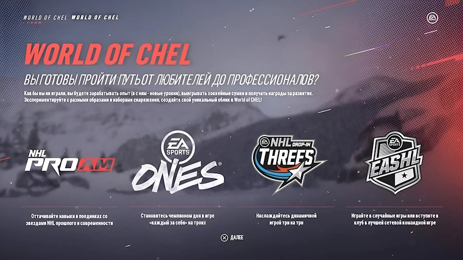
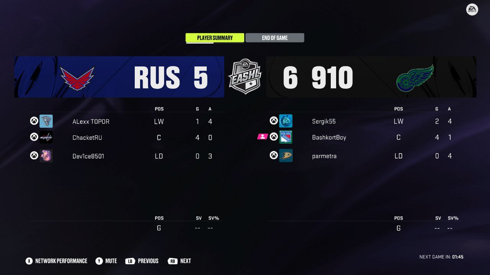

# Regulations for Virtual Hockey Tournaments in World of CHEL Mode (WoC / CHEL)

## Introduction

The main part of the rules comes from the [main regulations for CYBER-ICE.RU tournaments](/nhl/nhl.md).

> The tournament is held in game versions for Xbox Series X|S and PlayStation 5 (Current Gen).

## 1 Requirements for Teams and Participants

1.1 The club name in the game must match the team name.

1.2 Please provide the team logo as an image or a link to an image. If none is given, the team abbreviation will be used.

1.2.1 The team logo can be different from the one used in the game, but it must not break copyright rules. This means if you take an image from the internet for the team emblem, you must have permission to use it.

1.2.2 If you want to use logos from real hockey clubs (KHL, VHL, MHL and so on) or other legal organisations, you need to ask for permission from an official person. See all extra information in the [Regulations for Applying to Recognise a Team as an Official Representative of an Organisation in the CYBER-ICE.RU League](/woc/official_team.md)

1.2.3 Otherwise, you can create a logo image for your team using AI tools or find a free-to-use image online.

1.3 Team names/abbreviations/logos that contain offensive, rude, discriminatory words or go against moral standards and laws are not allowed. The administration can refuse registration if these rules are not followed.

1.4 Participants are advised to put their real first and last names on the jerseys of their virtual players. If a participant does not want to share personal details, that is their right.

1.4.1 If the name and/or surname of a virtual player contains offensive, rude, discriminatory words or goes against moral standards and laws in Russian and/or English, the participant's team gets a technical loss with a score of 0:5 in that match or a replay is needed. To prove the violation, you must provide a photo or video that clearly shows it.

1.5 Requirements for the Appearance of Team Uniforms

1.5.1 The team uniform includes three parts: helmet, upper clothing (jersey) and lower part (shorts + socks).

1.5.2 The home uniform must be a bright, contrasting colour to make it easy to see on the ice.

1.5.3 The away uniform must be a light colour (for example, white) with coloured parts, so it does not blend with the ice and is different from the opponent's home uniform.

1.5.4 If there is a clash of uniform colours (too similar to the opponent's), the home team must use an alternative kit.

1.5.5 For any other questions about uniforms, contact the Administration.

## 2 Team Compositions and Transfers

### 2.1 Team Compositions

2.1.1 The number of players in a team depends on the tournament format and follows these rules:

- 3v3: minimum 3 players, maximum 6 players
- 6v6: minimum 5 players, maximum 10 players

2.1.2 Bots in matches:
- If the season uses bot goalkeepers, then everyone plays only as a field player.
- If the season uses human goalkeepers, there should be no bots in the match.

2.1.3 Limits on team composition for the Silver Division (players of "Gold" level):
- in 3v3 format: no more than 1 "Gold" player in the team;
- in 6v6 format: no more than 2 "Gold" players in the team.

2.1.4 If two seasons are held at the same time (Golden and Silver divisions), a participant can take part only in one of them.

## 2.2 Transfers

2.2.1 During the season, transfers are allowed. This means you can move a player from one club to another, add a new participant to the team, or remove someone from the team.

2.2.2 The number of transfers for one season is 5.

2.2.3 A transfer counts as signing a player to the team from free agents or from another team. Removing a player from the team does not use up a transfer.

2.2.4 You can do transfers during the group stage, as long as at least one match from all the regular championship games is still not played. As soon as all games in the group stage are finished, the transfer window closes for all teams.

2.2.5 Submission and Approval

2.2.5.1 The team captain posts the transfer request in the special topic of the official tournament chat, including:
- the player's name;
- nickname;
- gaming platform (Xbox / PlayStation);
- team name.

2.2.5.2 The player must be registered on the CYBER-ICE.RU platform before the request is submitted; otherwise, the request is automatically rejected and must be submitted again after registration.

2.2.5.3 The transfer is approved after confirmation from the Administration and a public announcement in the chat. Only after that can the player play for the team.

2.2.6 Special Features for Transfers in Golden Division Teams

2.2.6.1 There are no limits on the level of players in the team.

2.2.6.2 If the Administration does not reply to the request within 60 minutes of it being posted, and there is a free spot in the team and an available transfer (see point 2.2.2), the transfer is automatically approved. The Administration will then post the announcement in the chat.

2.2.7 Special Features for Transfers in Silver Division Teams

2.2.7.1 The team limits are set out in point 2.1.3 of these Rules.

2.2.7.2 Requests in the Silver Division must be reviewed by a special judging panel within 24 hours to check if they meet the limits in point 2.2.7.1. The panel sends the decision to the Administration, who then approves or rejects the transfer. If rejected, the reason is given. An announcement in the chat is required; the player can only play for the team after this announcement.

## 3 Positions and Lineups

3.1. Participants can change their player positions in each match. They can choose between centre forward, winger, defender and goalkeeper (if the season uses human goalkeepers).

3.2. Starting from NHL 25, all abilities (perks) will be allowed, including those that were banned before. This point may change after a vote at the end of the season.

## 4 Match Settings and Rules

4.1. The number of matches between teams in the regular season is decided by the Administration after registration closes and the final list of teams is approved. By default, there are two matches (home and away), but this can change depending on the number of teams.

4.2 Match settings must be like this:

-   **Game Type** - Private Game
-   **Password** - Captains agree on a password between themselves
-   **Side Selection** - Captains agree on who starts at home and who away
-   **Server Selection** - Captains agree on the closest server, but usually it is Europe North-East or Europe North
-   **Allow Replay Skipping** - Captains agree between themselves, but it is recommended to set it to No if the match is being shown live with commentary
-   **Period Length** - 4 minutes
-   **Grudge Match Game** - Captains agree between themselves, but it is recommended to set it to **No**

    

4.3. Only teams with a full lineup can play in a match. Bots must not play on the ice (except goalkeepers, if the season uses bot goalkeepers).

4.4.1.1 If a player disconnects from a team, the match does not continue from that moment. It must be stopped while a bot is on the ice (except the goalkeeper, if bot goalkeepers are used).

4.4.1.2 After a disconnection, note the time, the team scores and the player statistics.

4.4.1.3 See examples of when goals count or do not count after a disconnection in the document [World of CHEL. Appendix A](/woc/examples_a)

4.4.2 If there is a disconnection in the game or for a player, the match must be restarted so that all human players are on the ice. Take into account the time already played and the score. Also add 5:00 minutes of game time to make up for the last 60 seconds of the third period, which last 60 seconds in real time.

4.4.2.1 The period is set to 4 minutes in real time, which is the same as 20 minutes in game time. So, 1 minute in real time equals 5 minutes in game time.

4.4.2.2 If the disconnection happens in the third period in the last sixty seconds (in real time), after the restart the number of game seconds left to play is worked out like this: (number of remaining real-time seconds × 5).

4.4.3 Each team can have up to two disconnections per game. If there are more, the team gets a technical defeat if the opponent asks for it.

## 5 Scheduling Matches

5.1.1 Tournament matches are held at 20:00 Moscow time. However, captains can agree with each other on any other convenient time. But if they cannot find a compromise, the matches must be played at the fixed time - 20:00 MSK. This time is the main one in case of any disputes.

5.1.1.1 Captains need to arrange matches with other captains through private messages. Only messages between captains will be used if there are requests for a technical defeat or other disputes.

5.1.1.2 Messages with team managers, assistants, masseurs or other club members will not be considered. The team captain is responsible for scheduling matches and getting penalties.

5.1.2 After captains agree on matches, they send the following information to the tournament chat:

- Date and time of the matches
- Number of games planned for that time

5.1.3 If the number of games was not mentioned in the agreement, by default it is two games.

5.2.1 The waiting time for the other team is 15 minutes.

5.2.2 For example, captains agreed to start the game at 20:00. Team A is ready and waits for Team B. If Team B is more than 15 minutes late, Team B gets a technical defeat in that match if Team A asks for it.

5.3 If a match is already agreed, you can move it to another time or date no less than 2 hours before the start, or with agreement from both captains.

5.4 If a team starts a match with a player whose name and nickname are not in the team lineup, that team gets a technical defeat in the match. If both teams break this rule, the match will not count and a replay is needed. So if you have a new player in the lineup, you must sign them to the team - see more in points 2.2.\*.

## 6 Limits for Captains and Teams

6.1 Team captains cannot leave the team or move to another club during the current season. So if you take on the role of club leader before the tournament starts, you must see the season through to the end.

6.2.1 Captains whose team has withdrawn from the tournament or been disqualified cannot take part in the next seasons either as a captain or as a player. For more details: [Tournament Disciplinary Sanctions Rules](/control_and_penalties.md/control_and_penalties.md).

6.2.2 Teams (name, abbreviation and logo) that have withdrawn from the tournament or been disqualified cannot take part in the next seasons. For more details: [Tournament Disciplinary Sanctions Rules](/control_and_penalties.md/control_and_penalties.md).

6.2.3 The limit does not apply to players in that team, except the captain.

6.3 If someone tries to get around the limits by creating a second account, that participant will get a permanent ban from all future tournaments.

6.4 The legal way to remove sanctions is described in the general regulations in the point [Removing a Penalty](/control_and_penalties.md/control_and_penalties.md#6-снятие-штрафа).

## 7 Modified Time Frames

### 7.1 Match Calendar

> Teams must play **at least** 6-8 matches per week (according to the calendar). The exact number of games in the calendar is decided after team registration, but it must not go beyond these limits.
>
> You can play games from future weeks if the opponent also agrees.

7.1.1 Before the season starts, a match calendar is created. Teams must play their games according to it.

7.1.2 The calendar is divided into game weeks that last 7 days.

7.1.3 If a match is not played within the set time:

- 7.1.3.1 If a match planned for the current week does not happen by the end of the week, both teams get a technical defeat (TD) 0:0.

- 7.1.3.2 If one team gives proof (for example, screenshots) that the opponent avoided the game, the guilty team gets a TD 0:5.

- 7.1.3.3 Teams can agree to move the match <ins>**only one week forward**</ins>, but they must tell the Administration about it in advance. If the game is not played after the move, it cannot be moved again, and a TD will be given according to point 7.1.3.1 or 7.1.3.2.

7.1.4 The Administration must remind teams on Wednesday and on the last day of the game week (Friday) about matches that have not been played. Captains have until midnight on the deadline to:

- Agree with the opponent and play the match that day.
- Give proof that they tried, but the opponent did not agree to play (point 7.1.3.2).
- Agree on moving the match (point 7.1.3.3).

If this is not done, at midnight a TD (0:0) will be set according to point 7.1.3.1.

7.1.5 After a TD (0:0) is set at midnight on the deadline, no complaints from teams will be accepted. This is because they were warned on Wednesday and Friday, and had more than 12 hours to tell the Administration about the situation (points 7.1.3.2 and 7.1.3.3).

### 7.2 TD Limit

7.2.1 If during the season or at the end a team reaches 30% TD from all its matches in the regular season, it will be disqualified in the current and next season + matching sanctions for the captain. No sanctions apply to ordinary players in the team.

7.2.1.1 Disqualification in the current season: the team will get TD 0:5 for the remaining matches, if at the time of disqualification it had played 50% of its games in the tournament table. Otherwise, the team is removed from the table, and the results of its games are cancelled.

7.2.1.2 Disqualification in the next season: see points 6.2.1 and 6.2.2

## 8 Reporting Match Results

### 8.1 Adding Photo Results to the Tournament Chat

8.1.1 After the game finishes, the winning team must send two photos to the chat: the first one must show the player statistics for both teams in the match, and the second one the team statistics for the match. Example photos below:

Match Results, two screenshots <i>(click)</i>

 

8.1.2 If the score differs by exactly one goal (for example, 5:6), add a comment saying whether the match ended in regular time or in overtime.

8.1.3 If the winning team sends match results without player statistics for their own team and/or the opponent, then no personal results are added for anyone in that match; only the team score (except when results are loaded from EA servers).

### 8.2 Adding Results Through the Mini-Application

8.2.1 It is the duty of team captains to enter the match result through the mini-application into the tournament table.

8.2.2 If the match was played from start to finish without any player disconnections, this result can be loaded from the EA Sports API server (together with team results and player statistics). It is usually available within 5 minutes after the game ends.

8.2.3 If there was a disconnection in the match, the captain must enter the team scores and player statistics (goals, assists and saves) manually from screenshots.

## 9 Play-Offs

In the play-offs, teams play a Best of 5 series (first to 3 wins).